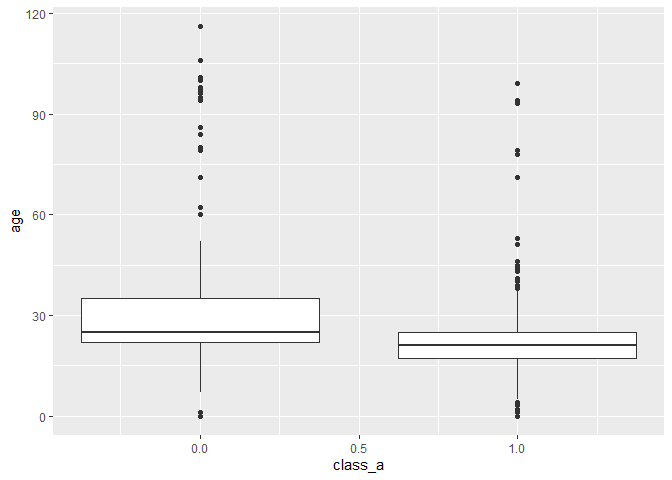

1. Visual story telling part 1: green buildings
===============================================

### 1-1 Considering the preliminary recommendation

From reading the preliminary recommendation, we would have to test to
make sure the analysis was sound. The biggest point in the
recommendation is making sure the comparison of the median market prices
did not introduce other factors that could cause the differences in
perceived price difference.

Conclusion: When we examine the recommendation, we can see that other
factors may cause the differences in rent prices, which means the
project should consider more information to conclude that the
certification would bring higher rent.

    library(mosaic)

    ## Loading required package: dplyr

    ## 
    ## Attaching package: 'dplyr'

    ## The following objects are masked from 'package:stats':
    ## 
    ##     filter, lag

    ## The following objects are masked from 'package:base':
    ## 
    ##     intersect, setdiff, setequal, union

    ## Loading required package: lattice

    ## Loading required package: ggformula

    ## Loading required package: ggplot2

    ## Loading required package: ggstance

    ## 
    ## Attaching package: 'ggstance'

    ## The following objects are masked from 'package:ggplot2':
    ## 
    ##     geom_errorbarh, GeomErrorbarh

    ## 
    ## New to ggformula?  Try the tutorials: 
    ##  learnr::run_tutorial("introduction", package = "ggformula")
    ##  learnr::run_tutorial("refining", package = "ggformula")

    ## Loading required package: mosaicData

    ## Loading required package: Matrix

    ## Registered S3 method overwritten by 'mosaic':
    ##   method                           from   
    ##   fortify.SpatialPolygonsDataFrame ggplot2

    ## 
    ## The 'mosaic' package masks several functions from core packages in order to add 
    ## additional features.  The original behavior of these functions should not be affected by this.
    ## 
    ## Note: If you use the Matrix package, be sure to load it BEFORE loading mosaic.
    ## 
    ## Have you tried the ggformula package for your plots?

    ## 
    ## Attaching package: 'mosaic'

    ## The following object is masked from 'package:Matrix':
    ## 
    ##     mean

    ## The following object is masked from 'package:ggplot2':
    ## 
    ##     stat

    ## The following objects are masked from 'package:dplyr':
    ## 
    ##     count, do, tally

    ## The following objects are masked from 'package:stats':
    ## 
    ##     binom.test, cor, cor.test, cov, fivenum, IQR, median, prop.test,
    ##     quantile, sd, t.test, var

    ## The following objects are masked from 'package:base':
    ## 
    ##     max, mean, min, prod, range, sample, sum

    library(tidyverse)

    ## -- Attaching packages ---------------------------------------------------------------------------------- tidyverse 1.3.0 --

    ## v tibble  3.0.3     v purrr   0.3.4
    ## v tidyr   1.1.1     v stringr 1.4.0
    ## v readr   1.3.1     v forcats 0.5.0

    ## -- Conflicts ------------------------------------------------------------------------------------- tidyverse_conflicts() --
    ## x mosaic::count()            masks dplyr::count()
    ## x purrr::cross()             masks mosaic::cross()
    ## x mosaic::do()               masks dplyr::do()
    ## x tidyr::expand()            masks Matrix::expand()
    ## x dplyr::filter()            masks stats::filter()
    ## x ggstance::geom_errorbarh() masks ggplot2::geom_errorbarh()
    ## x dplyr::lag()               masks stats::lag()
    ## x tidyr::pack()              masks Matrix::pack()
    ## x mosaic::stat()             masks ggplot2::stat()
    ## x mosaic::tally()            masks dplyr::tally()
    ## x tidyr::unpack()            masks Matrix::unpack()

    library(ggplot2)

    GreenBuilding = read.csv(url("https://raw.githubusercontent.com/jgscott/STA380/master/data/greenbuildings.csv"))
    head(GreenBuilding)

    ##   CS_PropertyID cluster   size empl_gr  Rent leasing_rate stories age renovated
    ## 1        379105       1 260300    2.22 38.56        91.39      14  16         0
    ## 2        122151       1  67861    2.22 28.57        87.14       5  27         0
    ## 3        379839       1 164848    2.22 33.31        88.94      13  36         1
    ## 4         94614       1  93372    2.22 35.00        97.04      13  46         1
    ## 5        379285       1 174307    2.22 40.69        96.58      16   5         0
    ## 6         94765       1 231633    2.22 43.16        92.74      14  20         0
    ##   class_a class_b LEED Energystar green_rating net amenities cd_total_07
    ## 1       1       0    0          1            1   0         1        4988
    ## 2       0       1    0          0            0   0         1        4988
    ## 3       0       1    0          0            0   0         1        4988
    ## 4       0       1    0          0            0   0         0        4988
    ## 5       1       0    0          0            0   0         1        4988
    ## 6       1       0    0          0            0   0         1        4988
    ##   hd_total07 total_dd_07 Precipitation  Gas_Costs Electricity_Costs
    ## 1         58        5046         42.57 0.01370000        0.02900000
    ## 2         58        5046         42.57 0.01373149        0.02904455
    ## 3         58        5046         42.57 0.01373149        0.02904455
    ## 4         58        5046         42.57 0.01373149        0.02904455
    ## 5         58        5046         42.57 0.01373149        0.02904455
    ## 6         58        5046         42.57 0.01373149        0.02904455
    ##   cluster_rent
    ## 1        36.78
    ## 2        36.78
    ## 3        36.78
    ## 4        36.78
    ## 5        36.78
    ## 6        36.78

### 1-2 Verify what the analyst calculated in the preliminary recommendation

It appears the price difference between Green buildings and regular
buildings could be something other than just the building being green.
To verify this, we need to at least see that green buildings have higher
rent than buildings in the same cluster.

When we tested the dataset, we could verify it does look like there are
differences in the prices within cluster.

This means if the cluster was chosen properly, there may be observable
differences between prices.

    ##### 1 calculate mean by cluster, 

    # 1.1 Divide dataset into Green and regular
    GB_Green   = subset(GreenBuilding, green_rating == 1)
    GB_Regular = subset(GreenBuilding, green_rating == 0)

    # 1.2 Group by

    #GreenBuilding$cluster = factor(GreenBuilding$cluster)
    #GB_by_cluster <- GreenBuilding %>% group_by(cluster)
    #summary(GreenBuilding$cluster == 502)

    # 1.2 Calculate average rent by creating separate dataframe for green and regular cluster
    GB_Green_by_cluster  <- aggregate(GB_Green[, 5], list(GB_Green$cluster), mean)
    GB_Regular_by_cluster <- aggregate(GB_Regular[, 5], list(GB_Regular$cluster), mean)

    # 1.3 merge two dataset to compare
      # merge for each cluster
    GB_cluster_merged1 <- merge(GB_Green_by_cluster,GB_Regular_by_cluster,by="Group.1")
    GB_cluster_merged1 = rename(GB_cluster_merged1,  rent_green = x.x, rent_regular = x.y, cluster = Group.1)
      #add a new column for differences within cluster
    GB_cluster_merged1 <- transform(GB_cluster_merged1, rent_diff = rent_green - rent_regular)

    #
    summary(GB_cluster_merged1)

    ##     cluster         rent_green      rent_regular     rent_diff       
    ##  Min.   :   1.0   Min.   :  8.87   Min.   : 8.00   Min.   :-16.8200  
    ##  1st Qu.: 295.5   1st Qu.: 21.50   1st Qu.:19.73   1st Qu.: -0.4007  
    ##  Median : 490.0   Median : 27.60   Median :25.18   Median :  2.6600  
    ##  Mean   : 623.9   Mean   : 30.04   Mean   :26.83   Mean   :  3.2069  
    ##  3rd Qu.:1047.5   3rd Qu.: 35.58   3rd Qu.:31.82   3rd Qu.:  6.0621  
    ##  Max.   :1230.0   Max.   :138.07   Max.   :76.96   Max.   : 72.2367

    # 1.4 plot
    ggplot(data = GB_cluster_merged1) + geom_point(mapping = aes(x = rent_green, y = rent_regular, color = rent_diff)) +
      xlim(0, 150) + 
      ylim(0, 150)

### 1-3 Check to see if anything else could cause the rent price difference

Since the difference in price could be caused by some other factor, we
can compare some of the attributes of the green buildings against the
other buildings in the same cluster.

We can find that the green buildings, when compared to the other
buildings in the same cluster, are less old on average by 11.6 years
(median 7 years), have on average 6 more stories (median 3 more), larger
by mean 155,750 (median 96,105), and classified as A 32% more likely.

All of these differences suggest that the differences are not caused by
whether the building is rated as green or not, but rather other factors.

    ####### 2 Check for differences by leasing rate, age, stories, class a, 

    #Create a dataframe for green and regular clusters again with more columns
    GB_Green_by_cluster  <- aggregate(GB_Green[, 3:23], list(GB_Green$cluster), mean)
    GB_Regular_by_cluster <- aggregate(GB_Regular[, 3:23], list(GB_Regular$cluster), mean)

    # 1.3 merge two dataset to compare
    GB_cluster_merged <- merge(GB_Green_by_cluster,GB_Regular_by_cluster,by="Group.1",  suffixes = c("_green","_reg"))
    GB_cluster_merged <- transform(GB_cluster_merged, rent_diff = Rent_green - Rent_reg)
    GB_cluster_merged <- transform(GB_cluster_merged, age_diff = age_green - age_reg)
    GB_cluster_merged <- transform(GB_cluster_merged, stories_diff = stories_green - stories_reg)
    GB_cluster_merged <- transform(GB_cluster_merged, size_diff = size_green - size_reg)
    GB_cluster_merged <- transform(GB_cluster_merged, class_diff = class_a_green - class_b_reg)
    GB_cluster_merged <- transform(GB_cluster_merged, leasing_rate_diff = leasing_rate_green - leasing_rate_reg)

    #
    summary(GB_cluster_merged)[,44:48]

    ##    rent_diff           age_diff         stories_diff       size_diff      
    ##  Min.   :-16.8200   Min.   :-87.1667   Min.   :-17.000   Min.   :-435577  
    ##  1st Qu.: -0.4007   1st Qu.:-21.3464   1st Qu.:  0.000   1st Qu.:   6503  
    ##  Median :  2.6600   Median : -7.0000   Median :  3.000   Median :  96105  
    ##  Mean   :  3.2069   Mean   :-11.6478   Mean   :  6.131   Mean   : 155750  
    ##  3rd Qu.:  6.0621   3rd Qu.:  0.1181   3rd Qu.: 10.000   3rd Qu.: 231389  
    ##  Max.   : 72.2367   Max.   : 72.6923   Max.   : 61.000   Max.   :1455912  
    ##                                                                           
    ##    class_diff     
    ##  Min.   :-1.0000  
    ##  1st Qu.: 0.0000  
    ##  Median : 0.5000  
    ##  Mean   : 0.3228  
    ##  3rd Qu.: 0.7143  
    ##  Max.   : 1.0000  
    ## 

### 1-4 Visual confirmations

We can plot the relevant factors to visually observe the other factors
that show deviations from having the same mean between green buildings
and the rest of buildings.

    # 1-4 Differences in Age
    ggplot(data = GB_cluster_merged) + geom_point(mapping = aes(x = age_green, y = age_reg, color = rent_diff)) +
      xlim(0, 150) + 
      ylim(0, 150)

    # 1-4 Differences in Stories
    ggplot(data = GB_cluster_merged) + geom_point(mapping = aes(x = stories_green, y = stories_reg, color = rent_diff)) +
      xlim(0, 100) + 
      ylim(0, 100)

    # 1-4 Differences in Size
    ggplot(data = GB_cluster_merged) + geom_point(mapping = aes(x = size_green, y = size_reg, color = rent_diff)) +
      xlim(0, 2000000) + 
      ylim(0, 2000000)

    # 1-4 Differences in Class
    ggplot(data = GB_cluster_merged) + geom_point(mapping = aes(x = class_a_green, y = class_a_reg, color = rent_diff)) +
      xlim(0, 2) + 
      ylim(0, 2)

\#\#\# 1-5 Looking at other potential patterns in the cluster data

We can look for other patterns that may show us something about the
differences between the green buildings and regular buildings. These
patterns show relationship between the difference variables.

    # Looking at age and rent, based on total days
    ggplot(data = GB_cluster_merged) + geom_point(mapping = aes(x = age_diff, y = rent_diff, color = total_dd_07_green))

    # Looking at size and leasing rate, based on total days
    ggplot(data = GB_cluster_merged) + geom_point(mapping = aes(x =size_diff , y =leasing_rate_diff , color = total_dd_07_green))

    # Looking at age and leasing rate, based on class
    ggplot(data = GB_cluster_merged) + geom_point(mapping = aes(x = age_diff, y = leasing_rate_diff, color = class_diff))

    # Looking at rent and leasing rate, based on total days
    ggplot(data = GB_cluster_merged) + geom_point(mapping = aes(x = rent_diff , y =leasing_rate_diff , color = total_dd_07_green))

### 1-6 Looking for other potential patterns other than rent, only between green buildings

    ggplot(data=GB_Green) + geom_boxplot(mapping=aes(x=amenities, y=leasing_rate, group = cut_width(amenities, 0.5))) 

    ggplot(data = GB_Green) + geom_point(mapping = aes(x = age, y = leasing_rate, color = total_dd_07))

\#\#\# 1-7 By certain variables

It’s possible to look at some of the individual variables. These
visualizations show how whether a building is Class A is correlated to
other attributes.

Class A buildings:

    ggplot(data = GB_Green) + geom_point(mapping = aes(x = class_a, y =  Rent, color = total_dd_07))

    ggplot(data=GB_Green) + geom_boxplot(mapping=aes(x=class_a, y=leasing_rate, group = cut_width(class_a, 0.5))) 

    ggplot(data=GB_Green) + geom_boxplot(mapping=aes(x=class_a, y=age, group = cut_width(class_a, 0.5))) 

    ggplot(data=GB_Green) + geom_boxplot(mapping=aes(x=class_a, y=Rent, group = cut_width(class_a, 0.5))) 

    ggplot(data=GB_Green) + geom_boxplot(mapping=aes(x=class_a, y=leasing_rate, group = cut_width(class_a, 0.5))) 

Total Degree Days:

    ggplot(data = GB_cluster_merged) + geom_point(mapping = aes(x = total_dd_07_green, y = Rent_green, color = rent_diff))

### 1-8 looking for other potential patterns in the general data

Boxplots between green buildings and regular buildings. We can see that
green buildings with green rating do have higher leasing rate on
average.

    # 1-8 Green rating
    ggplot(data=GreenBuilding) + geom_boxplot(mapping=aes(x=green_rating, y=leasing_rate, group = cut_width(green_rating, 0.5))) 

Other factors were plotted to see if any particular patterns existed.

    ggplot(data = GreenBuilding) + geom_point(mapping = aes(x = age, y = Rent, color = green_rating))

    ggplot(data = GreenBuilding) + geom_point(mapping = aes(x = age, y = leasing_rate, color = total_dd_07))

    ggplot(data = GreenBuilding) + geom_point(mapping = aes(x = empl_gr, y = leasing_rate, color = total_dd_07))

    ## Warning: Removed 74 rows containing missing values (geom_point).

    ggplot(data = GreenBuilding) + geom_point(mapping = aes(x = Rent , y = leasing_rate, color = total_dd_07))

### 1-9 Histograms

A few histograms were drawn to check dispersion of data.

    plot(Rent ~ leasing_rate, data=GreenBuilding) 

    hist(GreenBuilding$Rent, breaks=20)

    hist(GreenBuilding$leasing_rate, breaks=20)

    hist(GreenBuilding$Electricity_Costs, breaks=20)

    hist(GreenBuilding$stories, breaks=20)

    hist(GreenBuilding$age, breaks=20)

    hist(GreenBuilding$size, breaks=20)

Visual story telling part 2: flights at ABIA
============================================

Several graphs were created, mostly focusing on the carriers and delays.

    library(mosaic)
    library(tidyverse)
    library(ggplot2)

    ABIA = read.csv(url("https://raw.githubusercontent.com/jgscott/STA380/master/data/ABIA.csv"))
    head(ABIA)

    ##   Year Month DayofMonth DayOfWeek DepTime CRSDepTime ArrTime CRSArrTime
    ## 1 2008     1          1         2     120       1935     309       2130
    ## 2 2008     1          1         2     555        600     826        835
    ## 3 2008     1          1         2     600        600     728        729
    ## 4 2008     1          1         2     601        605     727        750
    ## 5 2008     1          1         2     601        600     654        700
    ## 6 2008     1          1         2     636        645     934        932
    ##   UniqueCarrier FlightNum TailNum ActualElapsedTime CRSElapsedTime AirTime
    ## 1            9E      5746  84129E               109            115      88
    ## 2            AA      1614  N438AA               151            155     133
    ## 3            YV      2883  N922FJ               148            149     125
    ## 4            9E      5743  89189E                86            105      70
    ## 5            AA      1157  N4XAAA                53             60      38
    ## 6            NW      1674   N967N               178            167     145
    ##   ArrDelay DepDelay Origin Dest Distance TaxiIn TaxiOut Cancelled
    ## 1      339      345    MEM  AUS      559      3      18         0
    ## 2       -9       -5    AUS  ORD      978      7      11         0
    ## 3       -1        0    AUS  PHX      872      7      16         0
    ## 4      -23       -4    AUS  MEM      559      4      12         0
    ## 5       -6        1    AUS  DFW      190      5      10         0
    ## 6        2       -9    AUS  MSP     1042     11      22         0
    ##   CancellationCode Diverted CarrierDelay WeatherDelay NASDelay SecurityDelay
    ## 1                         0          339            0        0             0
    ## 2                         0           NA           NA       NA            NA
    ## 3                         0           NA           NA       NA            NA
    ## 4                         0           NA           NA       NA            NA
    ## 5                         0           NA           NA       NA            NA
    ## 6                         0           NA           NA       NA            NA
    ##   LateAircraftDelay
    ## 1                 0
    ## 2                NA
    ## 3                NA
    ## 4                NA
    ## 5                NA
    ## 6                NA

### 2-1. Distance by Carrier

We can look at how each carrier differs in terms of the distances they
operate. Some operators seem to operate shorter distances, such as AA,
while B6 tends to travel farther per trip.

    ggplot(data=ABIA) + geom_boxplot(mapping=aes(x=UniqueCarrier, y=Distance)) +
    labs(
        title = "Distance Comparisons for each Carrier",
        caption = "Some airlines travel more than others"
    )

    ggplot(data=ABIA) + geom_boxplot(mapping=aes(x=UniqueCarrier, y=CRSElapsedTime, color = Distance)) 

    ## Warning: Removed 11 rows containing non-finite values (stat_boxplot).

### 2-2. Distance by Carrier

We can consider delays of trips. We can see that some trips were delays
for quite a long time.

    ggplot(data = ABIA) +   geom_point(mapping = aes(x = ArrDelay, y = DepDelay, color = UniqueCarrier)) +
    labs(
        title = "Departure Delay vs Arrival Delay",
        caption = "Delays"
      )

    ## Warning: Removed 1601 rows containing missing values (geom_point).

### 2-3 Delays by hour of day

We can see that departure delays occur less early morning, when there
are less flights.

    ggplot(data = ABIA) +   geom_point(mapping = aes(x = DepTime, y = DepDelay, color = UniqueCarrier)) +
    labs(
        title = "Departure Delay vs Departure Time",
        caption = "Delays by hour"
      )

    ## Warning: Removed 1413 rows containing missing values (geom_point).

\#\#\# 2-4 Arrival Delays for Shorter Flights

    Distance_shorter = ABIA$Distance[ABIA$Distance <= 4000]
    # adding a caption
    ggplot(ABIA, aes(ArrDelay, Distance_shorter)) +
      geom_point(aes(color = DayOfWeek)) +
      geom_smooth(se = FALSE) +
      labs(
        title = "Shorter Distance flights vs Arrival Delays",
        caption = "Colored according to day of week"
      )

    ## `geom_smooth()` using method = 'gam' and formula 'y ~ s(x, bs = "cs")'

    ## Warning: Removed 1601 rows containing non-finite values (stat_smooth).

    ## Warning: Removed 1601 rows containing missing values (geom_point).

### 2.5 Departure delay by carrier

We can see that some carriers have less longer delays.

    ggplot(ABIA, aes(DepDelay, UniqueCarrier)) +
      geom_point(aes(color = Month)) +
      geom_smooth(se = FALSE) +
      labs(
        title = "Departure delay by carrier",
        caption = "Color by month"
      )

    ## `geom_smooth()` using method = 'gam' and formula 'y ~ s(x, bs = "cs")'

    ## Warning: Removed 1413 rows containing non-finite values (stat_smooth).

    ## Warning: Computation failed in `stat_smooth()`:
    ## NA/NaN/Inf in foreign function call (arg 3)

    ## Warning: Removed 1413 rows containing missing values (geom_point).

\#\#\# 2-6 Carrier Delays

We can also observe that differences among carriers with CarrierDelay
variable.

    ggplot(data=ABIA) + geom_boxplot(mapping=aes(x=UniqueCarrier, y=CarrierDelay, color = Distance)) 

    ## Warning: Removed 79513 rows containing non-finite values (stat_boxplot).

### Next, we can look at how airport treats different carriers

### 2-6 Airport Taxi time for each carrier

We can see that certain carriers take less time to taxi in and out of
the airport.

    #Airport performances
    ggplot(data=ABIA) + geom_boxplot(mapping=aes(x=UniqueCarrier, y=TaxiIn, color = Distance)) 

    ## Warning: Removed 1567 rows containing non-finite values (stat_boxplot).

    ggplot(data=ABIA) + geom_boxplot(mapping=aes(x=UniqueCarrier, y=TaxiOut, color = Distance)) 

    ## Warning: Removed 1419 rows containing non-finite values (stat_boxplot).

### 2-7 Origin and Arrival Delay

We can see if flights from certain origin are more likely to arrive
late.

    ggplot(data=ABIA) + geom_boxplot(mapping=aes(x=Origin, y=ArrDelay, color = UniqueCarrier)) +
        theme(axis.text.x = element_text(angle=90, vjust=0.6))

    ## Warning: Removed 1601 rows containing non-finite values (stat_boxplot).

### 2-8 Deprature Time and Departure Delay, by month

We can see for each destination whether there is some visual
relationship between departure time and departure delay.

    ggplot(data = ABIA) +   geom_point(mapping = aes(x = DepTime, y = DepDelay)) + 
          facet_wrap(~ Month, nrow = 3) +
          theme(axis.text.x = element_text(angle=90, vjust=0.6))

    ## Warning: Removed 1413 rows containing missing values (geom_point).

### 2-9 Flight Schedule by departure time and destination

We can color code each carrier to observe if any patterns exist and see
that certain destinations have only one carrier.

    ggplot(data = ABIA) +   geom_point(mapping = aes(x = Dest, y = DepTime, color = UniqueCarrier)) +
          theme(axis.text.x = element_text(angle=90, vjust=0.6))

    ## Warning: Removed 1413 rows containing missing values (geom_point).

3. Portfolio modeling
=====================

### 3-1 Constructing the three portfolios

Three portfolios of different focuses were selected by selecting 5
different funds each with equal weights. The portfolios were rebalanced
each day at zero transaction cost. The portfolios are the following:

(Portfolio 1) Portfolio consisting of large-cap growth, technology, and
world stock indexes 1) XLK: Technology Select Sector SPDR Fund 2) VT:
Vanguard Total World Stock Index Fund ETF Shares 3) SCHG: Schwab U.S.
Large-Cap Growth ETF 4) VWO: Vanguard FTSE Emerging Markets ETF

(Portfolio 2) Portfolio consisting of hedge fund, commodities, real
estate, and bond funds 1) MNA: IQ Merger Arbitrage ETF (MNA) 2) PDBC:
Invesco Optimum Yield Diversified Commodity Strategy No K-1 ETF 3) BND:
Vanguard Total Bond Market ETF 4) BNDX: Vanguard Total International
Bond ETF 5) VNQ: Vanguard Real Estate Index Fund

(Portfolio 3) portfolio consisting of technology, health care and total
stock market funds 1) IYW: iShares U.S. Technology ETF 2) XLV: Health
Care Select Sector SPDR Fund 3) VTI: Vanguard Total Stock Market Index
Fund ETF Shares (VTI) 4) IXJ: iShares Global Healthcare ETF 5) VGT:
Vanguard Information Technology ETF

When the returns of the three portfolios were compared, Portfolio 3 had
the highest VaR, followed by Portfolio 1 and 2. The results kept
changing so set.seed(1) was used to report a constant number.

    library(mosaic)
    library(quantmod)

    ## Loading required package: xts

    ## Loading required package: zoo

    ## 
    ## Attaching package: 'zoo'

    ## The following objects are masked from 'package:base':
    ## 
    ##     as.Date, as.Date.numeric

    ## 
    ## Attaching package: 'xts'

    ## The following objects are masked from 'package:dplyr':
    ## 
    ##     first, last

    ## Loading required package: TTR

    ## Registered S3 method overwritten by 'quantmod':
    ##   method            from
    ##   as.zoo.data.frame zoo

    ## Version 0.4-0 included new data defaults. See ?getSymbols.

    library(foreach)

    ## 
    ## Attaching package: 'foreach'

    ## The following objects are masked from 'package:purrr':
    ## 
    ##     accumulate, when

    mystocks1 = c("XLK", "VT", "SCHG", "SCHE", "VWO")
    mystocks2 = c("MNA", "PDBC", "BND", "BNDX", "VNQ")
    mystocks3 = c("IYW", "XLV", "VTI", "IXJ", "VGT")
    myprices1 = getSymbols(mystocks1, from = "2015-08-01", to = "2020-07-31")

    ## 'getSymbols' currently uses auto.assign=TRUE by default, but will
    ## use auto.assign=FALSE in 0.5-0. You will still be able to use
    ## 'loadSymbols' to automatically load data. getOption("getSymbols.env")
    ## and getOption("getSymbols.auto.assign") will still be checked for
    ## alternate defaults.
    ## 
    ## This message is shown once per session and may be disabled by setting 
    ## options("getSymbols.warning4.0"=FALSE). See ?getSymbols for details.

    myprices2 = getSymbols(mystocks2, from = "2015-08-01", to = "2020-07-31")
    myprices3 = getSymbols(mystocks3, from = "2015-08-01", to = "2020-07-31")

    # A chunk of code for adjusting all stocks
    # creates a new object adding 'a' to the end
    # For example, WMT becomes WMTa, etc
    for(ticker in mystocks1) {
        expr = paste0(ticker, "a = adjustOHLC(", ticker, ")")
        eval(parse(text=expr))
    }

    ## Warning in read.table(file = file, header = header, sep = sep,
    ## quote = quote, : incomplete final line found by readTableHeader
    ## on 'https://query2.finance.yahoo.com/v7/finance/download/XLK?
    ## period1=-2208988800&period2=1597708800&interval=1d&events=split&crumb=FEnEEMbAock'

    ## Warning in read.table(file = file, header = header, sep = sep,
    ## quote = quote, : incomplete final line found by readTableHeader
    ## on 'https://query1.finance.yahoo.com/v7/finance/download/XLK?
    ## period1=-2208988800&period2=1597708800&interval=1d&events=split&crumb=FEnEEMbAock'

    ## Warning in read.table(file = file, header = header, sep = sep,
    ## quote = quote, : incomplete final line found by readTableHeader
    ## on 'https://query2.finance.yahoo.com/v7/finance/download/VT?
    ## period1=-2208988800&period2=1597708800&interval=1d&events=split&crumb=FEnEEMbAock'

    ## Warning in read.table(file = file, header = header, sep = sep,
    ## quote = quote, : incomplete final line found by readTableHeader
    ## on 'https://query1.finance.yahoo.com/v7/finance/download/VT?
    ## period1=-2208988800&period2=1597708800&interval=1d&events=split&crumb=FEnEEMbAock'

    ## Warning in read.table(file = file, header = header, sep = sep,
    ## quote = quote, : incomplete final line found by readTableHeader
    ## on 'https://query2.finance.yahoo.com/v7/finance/download/SCHG?
    ## period1=-2208988800&period2=1597708800&interval=1d&events=split&crumb=FEnEEMbAock'

    ## Warning in read.table(file = file, header = header, sep = sep,
    ## quote = quote, : incomplete final line found by readTableHeader
    ## on 'https://query1.finance.yahoo.com/v7/finance/download/SCHG?
    ## period1=-2208988800&period2=1597708800&interval=1d&events=split&crumb=FEnEEMbAock'

    ## Warning in read.table(file = file, header = header, sep = sep,
    ## quote = quote, : incomplete final line found by readTableHeader
    ## on 'https://query2.finance.yahoo.com/v7/finance/download/SCHE?
    ## period1=-2208988800&period2=1597708800&interval=1d&events=split&crumb=FEnEEMbAock'

    ## Warning in read.table(file = file, header = header, sep = sep,
    ## quote = quote, : incomplete final line found by readTableHeader
    ## on 'https://query2.finance.yahoo.com/v7/finance/download/SCHE?
    ## period1=-2208988800&period2=1597708800&interval=1d&events=split&crumb=FEnEEMbAock'

    ## Warning in read.table(file = file, header = header, sep = sep,
    ## quote = quote, : incomplete final line found by readTableHeader
    ## on 'https://query1.finance.yahoo.com/v7/finance/download/VWO?
    ## period1=-2208988800&period2=1597708800&interval=1d&events=split&crumb=FEnEEMbAock'

    ## Warning in read.table(file = file, header = header, sep = sep,
    ## quote = quote, : incomplete final line found by readTableHeader
    ## on 'https://query2.finance.yahoo.com/v7/finance/download/VWO?
    ## period1=-2208988800&period2=1597708800&interval=1d&events=split&crumb=FEnEEMbAock'

    for(ticker in mystocks2) {
        expr = paste0(ticker, "a = adjustOHLC(", ticker, ")")
        eval(parse(text=expr))
    }

    ## Warning in read.table(file = file, header = header, sep = sep,
    ## quote = quote, : incomplete final line found by readTableHeader
    ## on 'https://query2.finance.yahoo.com/v7/finance/download/MNA?
    ## period1=-2208988800&period2=1597708800&interval=1d&events=split&crumb=FEnEEMbAock'

    ## Warning in read.table(file = file, header = header, sep = sep,
    ## quote = quote, : incomplete final line found by readTableHeader
    ## on 'https://query2.finance.yahoo.com/v7/finance/download/MNA?
    ## period1=-2208988800&period2=1597708800&interval=1d&events=split&crumb=FEnEEMbAock'

    ## Warning in read.table(file = file, header = header, sep = sep,
    ## quote = quote, : incomplete final line found by readTableHeader
    ## on 'https://query1.finance.yahoo.com/v7/finance/download/PDBC?
    ## period1=-2208988800&period2=1597708800&interval=1d&events=div&crumb=FEnEEMbAock'

    ## Warning in read.table(file = file, header = header, sep = sep,
    ## quote = quote, : incomplete final line found by readTableHeader
    ## on 'https://query1.finance.yahoo.com/v7/finance/download/PDBC?
    ## period1=-2208988800&period2=1597708800&interval=1d&events=split&crumb=FEnEEMbAock'

    ## Warning in read.table(file = file, header = header, sep = sep,
    ## quote = quote, : incomplete final line found by readTableHeader
    ## on 'https://query2.finance.yahoo.com/v7/finance/download/PDBC?
    ## period1=-2208988800&period2=1597708800&interval=1d&events=split&crumb=FEnEEMbAock'

    ## Warning in read.table(file = file, header = header, sep = sep,
    ## quote = quote, : incomplete final line found by readTableHeader
    ## on 'https://query2.finance.yahoo.com/v7/finance/download/BND?
    ## period1=-2208988800&period2=1597708800&interval=1d&events=split&crumb=FEnEEMbAock'

    ## Warning in read.table(file = file, header = header, sep = sep,
    ## quote = quote, : incomplete final line found by readTableHeader
    ## on 'https://query2.finance.yahoo.com/v7/finance/download/BND?
    ## period1=-2208988800&period2=1597708800&interval=1d&events=split&crumb=FEnEEMbAock'

    ## Warning in read.table(file = file, header = header, sep = sep,
    ## quote = quote, : incomplete final line found by readTableHeader
    ## on 'https://query2.finance.yahoo.com/v7/finance/download/BNDX?
    ## period1=-2208988800&period2=1597708800&interval=1d&events=split&crumb=FEnEEMbAock'

    ## Warning in read.table(file = file, header = header, sep = sep,
    ## quote = quote, : incomplete final line found by readTableHeader
    ## on 'https://query2.finance.yahoo.com/v7/finance/download/BNDX?
    ## period1=-2208988800&period2=1597708800&interval=1d&events=split&crumb=FEnEEMbAock'

    ## Warning in read.table(file = file, header = header, sep = sep,
    ## quote = quote, : incomplete final line found by readTableHeader
    ## on 'https://query2.finance.yahoo.com/v7/finance/download/VNQ?
    ## period1=-2208988800&period2=1597708800&interval=1d&events=split&crumb=FEnEEMbAock'

    ## Warning in read.table(file = file, header = header, sep = sep,
    ## quote = quote, : incomplete final line found by readTableHeader
    ## on 'https://query2.finance.yahoo.com/v7/finance/download/VNQ?
    ## period1=-2208988800&period2=1597708800&interval=1d&events=split&crumb=FEnEEMbAock'

    for(ticker in mystocks3) {
        expr = paste0(ticker, "a = adjustOHLC(", ticker, ")")
        eval(parse(text=expr))
    }

    ## Warning in read.table(file = file, header = header, sep = sep,
    ## quote = quote, : incomplete final line found by readTableHeader
    ## on 'https://query1.finance.yahoo.com/v7/finance/download/IYW?
    ## period1=-2208988800&period2=1597708800&interval=1d&events=split&crumb=FEnEEMbAock'

    ## Warning in read.table(file = file, header = header, sep = sep,
    ## quote = quote, : incomplete final line found by readTableHeader
    ## on 'https://query2.finance.yahoo.com/v7/finance/download/IYW?
    ## period1=-2208988800&period2=1597708800&interval=1d&events=split&crumb=FEnEEMbAock'

    ## Warning in read.table(file = file, header = header, sep = sep,
    ## quote = quote, : incomplete final line found by readTableHeader
    ## on 'https://query1.finance.yahoo.com/v7/finance/download/XLV?
    ## period1=-2208988800&period2=1597708800&interval=1d&events=split&crumb=FEnEEMbAock'

    ## Warning in read.table(file = file, header = header, sep = sep,
    ## quote = quote, : incomplete final line found by readTableHeader
    ## on 'https://query2.finance.yahoo.com/v7/finance/download/XLV?
    ## period1=-2208988800&period2=1597708800&interval=1d&events=split&crumb=FEnEEMbAock'

    ## Warning in read.table(file = file, header = header, sep = sep,
    ## quote = quote, : incomplete final line found by readTableHeader
    ## on 'https://query1.finance.yahoo.com/v7/finance/download/VTI?
    ## period1=-2208988800&period2=1597708800&interval=1d&events=split&crumb=FEnEEMbAock'

    ## Warning in read.table(file = file, header = header, sep = sep,
    ## quote = quote, : incomplete final line found by readTableHeader
    ## on 'https://query2.finance.yahoo.com/v7/finance/download/VTI?
    ## period1=-2208988800&period2=1597708800&interval=1d&events=split&crumb=FEnEEMbAock'

    ## Warning in read.table(file = file, header = header, sep = sep,
    ## quote = quote, : incomplete final line found by readTableHeader
    ## on 'https://query2.finance.yahoo.com/v7/finance/download/IXJ?
    ## period1=-2208988800&period2=1597708800&interval=1d&events=split&crumb=FEnEEMbAock'

    ## Warning in read.table(file = file, header = header, sep = sep,
    ## quote = quote, : incomplete final line found by readTableHeader
    ## on 'https://query2.finance.yahoo.com/v7/finance/download/IXJ?
    ## period1=-2208988800&period2=1597708800&interval=1d&events=split&crumb=FEnEEMbAock'

    ## Warning in read.table(file = file, header = header, sep = sep,
    ## quote = quote, : incomplete final line found by readTableHeader
    ## on 'https://query2.finance.yahoo.com/v7/finance/download/VGT?
    ## period1=-2208988800&period2=1597708800&interval=1d&events=split&crumb=FEnEEMbAock'

    ## Warning in read.table(file = file, header = header, sep = sep,
    ## quote = quote, : incomplete final line found by readTableHeader
    ## on 'https://query1.finance.yahoo.com/v7/finance/download/VGT?
    ## period1=-2208988800&period2=1597708800&interval=1d&events=split&crumb=FEnEEMbAock'

    # Combine all the returns in a matrix
    all_returns1 = cbind( ClCl(XLKa),   ClCl(VTa),  ClCl(SCHGa),    ClCl(SCHEa),    ClCl(VWOa))
    all_returns2 = cbind( ClCl(MNAa),   ClCl(PDBCa),    ClCl(BNDa), ClCl(BNDXa),    ClCl(VNQa))
    all_returns3 = cbind( ClCl(IYWa),   ClCl(XLVa), ClCl(VTIa), ClCl(IXJa), ClCl(VGTa))
    head(all_returns1)

    ##                ClCl.XLKa      ClCl.VTa   ClCl.SCHGa   ClCl.SCHEa    ClCl.VWOa
    ## 2015-08-03            NA            NA           NA           NA           NA
    ## 2015-08-04 -0.0059031880  0.0001624492 -0.001815853  0.002652476  0.003183922
    ## 2015-08-05  0.0097387178  0.0024358232  0.004184100  0.003086420  0.001057842
    ## 2015-08-06 -0.0098799816 -0.0063178357 -0.010688406 -0.008351692 -0.007133316
    ## 2015-08-07  0.0007127346 -0.0009781709 -0.002014301  0.000000000 -0.001064423
    ## 2015-08-10  0.0156695160  0.0125652744  0.011926642  0.018173760  0.017048455

    all_returns1 = as.matrix(na.omit(all_returns1))
    all_returns2 = as.matrix(na.omit(all_returns2))
    all_returns3 = as.matrix(na.omit(all_returns3))

    # Compute the returns from the closing prices
    pairs(all_returns1)

    pairs(all_returns2)

    pairs(all_returns3)

    # Sample a random return from the empirical joint distribution
    # This simulates a random day
    return1.today = resample(all_returns1, 1, orig.ids=FALSE)
    return2.today = resample(all_returns2, 1, orig.ids=FALSE)
    return3.today = resample(all_returns3, 1, orig.ids=FALSE)

### 3-2 Constructing portfolio 1

The returns of Portfolio 1 was simulated 5,000 times. The 20-eday 5%
Value at Risk for this portfolio turned out to be around $3,573.

    ######## Portfolio 1

    # Update the value of your holdings
    # Assumes an equal allocation to each asset
    total_wealth1 = 100000
    my_weights1 = c(0.2,0.2,0.2, 0.2, 0.2)
    holdings1 = total_wealth1*my_weights1
    holdings1 = holdings1*(1 + return1.today)

    # Compute your new total wealth
    holdings1

    ##            ClCl.XLKa ClCl.VTa ClCl.SCHGa ClCl.SCHEa ClCl.VWOa
    ## 2018-04-04  20279.11 20159.06   20245.76   20035.09  20064.18

    total_wealth1 = sum(holdings1)
    total_wealth1

    ## [1] 100783.2

    # Now simulate many different possible futures
    # just repeating the above block thousands of times
    set.seed(1)
    initial_wealth1 = 100000
    sim1 = foreach(i=1:5000, .combine='rbind') %do% {
        total_wealth1 = initial_wealth1
        weights1 = c(0.2, 0.2, 0.2, 0.2, 0.2)
        holdings1 = weights1 * total_wealth1
        n_days = 20
        wealthtracker1 = rep(0, n_days)
        for(today in 1:n_days) {
            return1.today = resample(all_returns1, 1, orig.ids=FALSE)
            holdings1 = holdings1 + holdings1*return1.today
            total_wealth1 = sum(holdings1)
            wealthtracker1[today] = total_wealth1
        }
        wealthtracker1
    }

    # each row is a simulated trajectory
    # each column is a data
    head(sim1)

    ##               [,1]      [,2]      [,3]      [,4]      [,5]      [,6]      [,7]
    ## result.1 101463.08 100853.70  98991.39  99630.83  98983.00  98636.32  98213.84
    ## result.2  99775.25 101145.35 102053.13 101978.77 101951.31 102056.27 102148.98
    ## result.3 100366.35  99810.47 100252.92 102043.42 101446.55 101920.13  99355.64
    ## result.4 101705.43 101736.25 103796.58 103510.12 104053.12 102297.97 102778.23
    ## result.5 100267.76  98492.25  98827.10  99366.39  99462.11  99779.43  99861.65
    ## result.6  99808.88  99584.02 100109.76 100206.90 100322.02 100256.77 101867.85
    ##               [,8]      [,9]     [,10]     [,11]    [,12]    [,13]     [,14]
    ## result.1  99496.32  99970.93 100868.17 100638.68 101852.9 100194.6  99912.38
    ## result.2 101934.24 102049.62 103139.66 102119.96 102319.5 102460.4 102511.98
    ## result.3  99542.34  99202.06  99257.83  99755.89 101546.8 103769.0 104628.67
    ## result.4 103044.74 104325.12 104217.25 104880.49 105852.4 105074.6 104294.82
    ## result.5  99713.73  99171.99 100494.03 101536.97 102309.4 102692.4 102469.78
    ## result.6 102258.76 101222.32 101591.51 103670.31 103640.5 103745.7 103616.15
    ##              [,15]     [,16]     [,17]    [,18]    [,19]     [,20]
    ## result.1  98951.28  99463.78  99374.32 101115.0 100339.6  98729.43
    ## result.2 102803.39 103439.46 103864.67 101340.2 101997.7  99888.75
    ## result.3 103313.32 104132.11 103462.35 104273.2 104348.3 104177.65
    ## result.4 104891.14 105751.44 106296.50 104368.3 104704.6 103879.95
    ## result.5 105092.33 105386.36 105787.99 105531.3 103546.1 102600.05
    ## result.6 103897.02 104489.37 104565.58 103523.0 101883.7 102274.73

    hist(sim1[,n_days], 25)

    # Profit/loss
    mean(sim1[,n_days])

    ## [1] 100983.3

    cat("Mean return for the simulation is: ", mean(sim1[,n_days] - initial_wealth1), "\n")

    ## Mean return for the simulation is:  983.2637

    hist(sim1[,n_days] - initial_wealth1, breaks=100)

    # 5% value at risk:
    cat("Value at Risk for Portfolio 1 is: ", quantile(sim1[,n_days]- initial_wealth1, prob=0.05), "\n")

    ## Value at Risk for Portfolio 1 is:  -8194.645

    # note: this is  a negative number (a loss, e.g. -500), but we conventionally
    # express VaR as a positive number (e.g. 500)

### 3-3 Portfolio 2

The returns of Portfolio 1 was simulated 5,000 times. The 20-eday 5%
Value at Risk for this portfolio turned out to be around $3,573.

    ######## Portfolio 2

    # Update the value of your holdings
    # Assumes an equal allocation to each asset
    total_wealth2 = 100000
    my_weights2 = c(0.2,0.2,0.2, 0.2, 0.2)
    holdings2 = total_wealth2*my_weights2
    holdings2 = holdings2*(1 + return2.today)

    # Compute your new total wealth
    holdings2

    ##            ClCl.MNAa ClCl.PDBCa ClCl.BNDa ClCl.BNDXa ClCl.VNQa
    ## 2016-06-30  20021.13   19910.71  20026.13   19985.65  20207.38

    total_wealth2 = sum(holdings2)
    total_wealth2

    ## [1] 100151

    # Now simulate many different possible futures
    # just repeating the above block thousands of times
    set.seed(1)
    initial_wealth2 = 100000
    sim2 = foreach(i=1:5000, .combine='rbind') %do% {
        total_wealth2 = initial_wealth2
        weights2 = c(0.2, 0.2, 0.2, 0.2, 0.2)
        holdings2 = weights2 * total_wealth2
        n_days = 20
        wealthtracker2 = rep(0, n_days)
        for(today in 1:n_days) {
            return2.today = resample(all_returns2, 1, orig.ids=FALSE)
            holdings2 = holdings2 + holdings2*return2.today
            total_wealth2 = sum(holdings2)
            wealthtracker2[today] = total_wealth2
        }
        wealthtracker2
    }

    # each row is a simulated trajectory
    # each column is a data
    head(sim2)

    ##               [,1]      [,2]      [,3]      [,4]      [,5]      [,6]      [,7]
    ## result.1 100199.31 100350.67  99942.21  99994.72 100018.88  99770.55  99391.85
    ## result.2  99766.80 100144.32 100674.30 100836.17 100289.39 100082.43 100038.72
    ## result.3 100177.19  99946.76 100036.30 100333.01 100168.95 100572.14 100207.69
    ## result.4 100572.76 100424.03 103239.17 103411.68 103360.61 102499.82 102234.48
    ## result.5 100034.19  99709.39  99825.03  99655.73  99760.71  99875.22  99735.38
    ## result.6  99846.95  99772.01  99519.00  99082.68  99002.43  98973.46  99147.00
    ##               [,8]      [,9]     [,10]     [,11]     [,12]     [,13]     [,14]
    ## result.1 100375.63 100305.15 100823.51 100801.98 100957.26 100588.56 101118.37
    ## result.2 100187.07 100212.36 100484.93 100773.63 101174.04 100946.91 100673.27
    ## result.3 100103.35 100600.13 100382.36 100371.91 101433.66 101600.34 102092.84
    ## result.4 102125.63 102325.63 102281.30 102779.63 103014.62 102776.72 102371.81
    ## result.5  99780.35  99757.28  99848.61 100059.79  99760.25 100130.44 100241.32
    ## result.6  98990.28  99142.16  99325.82  99633.12  99126.41  98913.82  99325.25
    ##              [,15]     [,16]     [,17]     [,18]     [,19]     [,20]
    ## result.1 100734.58 100858.91 100816.03 101158.19 101016.09 100964.72
    ## result.2 100336.28  99726.08  99627.50  98936.15  99055.18  98737.56
    ## result.3 101956.38 103097.70 102517.29 102786.17 102488.08 102462.35
    ## result.4 101993.11 102272.13 102316.51 101907.63 102172.90 101937.33
    ## result.5 100298.65 100346.68 100337.32 100042.63 100464.11 100152.23
    ## result.6  99141.45  98773.88  98740.78  98908.68  98277.19  98255.31

    hist(sim2[,n_days], 25)

    # Profit/loss
    mean(sim2[,n_days])

    ## [1] 100262.7

    cat("Mean return for the simulation is: ", mean(sim2[,n_days] - initial_wealth2), "\n")

    ## Mean return for the simulation is:  262.7438

    hist(sim2[,n_days] - initial_wealth2, breaks=100)

    # 5% value at risk:
    cat("Value at Risk for Portfolio 2 is: ", quantile(sim2[,n_days]- initial_wealth2, prob=0.05), "\n")

    ## Value at Risk for Portfolio 2 is:  -3572.572

### 3-4 Portfolio 3

The returns of Portfolio 1 was simulated 5,000 times. The 20-day 5%
Value at Risk for this portfolio turned out to be around $7,892.

    ######## Portfolio 3

    # Update the value of your holdings
    # Assumes an equal allocation to each asset
    total_wealth3 = 100000
    my_weights3 = c(0.2,0.2,0.2, 0.2, 0.2)
    holdings3 = total_wealth3*my_weights3
    holdings3 = holdings3*(1 + return3.today)

    # Compute your new total wealth
    holdings3

    ##            ClCl.IYWa ClCl.XLVa ClCl.VTIa ClCl.IXJa ClCl.VGTa
    ## 2018-02-09  20489.97  20284.13   20274.9  20215.82  20482.86

    total_wealth3 = sum(holdings3)
    total_wealth3

    ## [1] 101747.7

    # Now simulate many different possible futures
    # just repeating the above block thousands of times
    set.seed(1)
    initial_wealth3 = 100000
    sim3 = foreach(i=1:5000, .combine='rbind') %do% {
        total_wealth3 = initial_wealth3
        weights3 = c(0.2, 0.2, 0.2, 0.2, 0.2)
        holdings3 = weights3 * total_wealth3
        n_days = 20
        wealthtracker3 = rep(0, n_days)
        for(today in 1:n_days) {
            return3.today = resample(all_returns3, 1, orig.ids=FALSE)
            holdings3 = holdings3 + holdings3*return3.today
            total_wealth3 = sum(holdings3)
            wealthtracker3[today] = total_wealth3
        }
        wealthtracker3
    }

    # each row is a simulated trajectory
    # each column is a data
    head(sim3)

    ##              [,1]      [,2]      [,3]      [,4]      [,5]      [,6]      [,7]
    ## result.1 101485.6 101201.36  98523.82  98503.80  98205.59  98043.32  98105.19
    ## result.2 100152.1 100974.23 101640.34 101600.59 101368.66 101581.01 101588.29
    ## result.3 100039.0  99577.53 100131.00 102307.17 102854.08 102790.53 101142.99
    ## result.4 101062.4 101389.71 102154.79 101576.55 101813.15  99374.71  99451.51
    ## result.5 100243.4  97633.52  97514.09  97770.84  97865.51  98346.41  98364.31
    ## result.6 100134.3  99299.33  99235.00  98910.65  99408.22  99830.66 101206.64
    ##               [,8]      [,9]     [,10]     [,11]     [,12]     [,13]     [,14]
    ## result.1  98299.66  98465.97  99113.70  98675.52  99866.98  98264.94  98006.87
    ## result.2 101705.05 102602.59 103575.75 102829.88 102752.93 102663.42 103021.85
    ## result.3 101502.68 101405.60 101562.84 102174.88 103396.55 105444.15 106730.56
    ## result.4  99448.74 100568.83 100585.80 101145.88 102263.57 101217.31 100540.03
    ## result.5  98126.63  97405.89  97959.07  99152.03 100140.79 100534.92 100168.35
    ## result.6 101389.47 100887.62 100610.31 102554.36 102332.30 102546.66 102923.44
    ##              [,15]     [,16]     [,17]     [,18]     [,19]     [,20]
    ## result.1  96976.21  97131.34  97351.54  98604.71  97911.57  96235.91
    ## result.2 103511.54 104017.91 104660.04 101657.63 102252.63 100642.28
    ## result.3 104866.19 104780.19 104097.82 104245.77 104267.07 104713.51
    ## result.4 100992.47 101135.81 102078.52  99370.08  98945.35  98029.94
    ## result.5 102959.14 103756.26 104119.79 103690.59 101558.62  99912.46
    ## result.6 102716.68 103184.59 103626.42 102526.48 100902.65 101394.85

    hist(sim3[,n_days], 25)

    # Profit/loss
    mean(sim3[,n_days])

    ## [1] 101447.9

    cat("Mean return for the simulation is: ", mean(sim3[,n_days] - initial_wealth3), "\n")

    ## Mean return for the simulation is:  1447.924

    hist(sim3[,n_days] - initial_wealth3, breaks=100)

    # 5% value at risk:
    cat("Value at Risk for Portfolio 3 is: ", quantile(sim3[,n_days]- initial_wealth3, prob=0.05), "\n")

    ## Value at Risk for Portfolio 3 is:  -7891.573

4. Market segmentation
======================

### 4-1 K-Means clustering

First, the dataset was used to create a K-Means clustering, and then an
elbow plot was created to see how many clusters would be relevant. Since
it appears there is no particular elbow. With the Gap statistic, it was
also unclear if there was a dip, maybe at 5, so will use 5 as the number
of K.

    library(ggplot2)
    library(LICORS)  # for kmeans++
    library(foreach)
    library(mosaic)
    library(cluster)

    Social_Marketing = read.csv(url('https://raw.githubusercontent.com/jgscott/STA380/master/data/social_marketing.csv'), header=TRUE)

    Social_summary = summary(Social_Marketing)

    ################ Draw some plots describing 

    boxplot(Social_Marketing[,4:11], cex.axis = 0.5) 

    boxplot(Social_Marketing[,12:19], cex.axis = 0.5)

    boxplot(Social_Marketing[,20:27], cex.axis = 0.5)

    boxplot(Social_Marketing[,28:36], cex.axis = 0.5)

    summary(Social_Marketing)

    ##       X                chatter       current_events      travel      
    ##  Length:7882        Min.   : 0.000   Min.   :0.000   Min.   : 0.000  
    ##  Class :character   1st Qu.: 2.000   1st Qu.:1.000   1st Qu.: 0.000  
    ##  Mode  :character   Median : 3.000   Median :1.000   Median : 1.000  
    ##                     Mean   : 4.399   Mean   :1.526   Mean   : 1.585  
    ##                     3rd Qu.: 6.000   3rd Qu.:2.000   3rd Qu.: 2.000  
    ##                     Max.   :26.000   Max.   :8.000   Max.   :26.000  
    ##  photo_sharing    uncategorized      tv_film      sports_fandom   
    ##  Min.   : 0.000   Min.   :0.000   Min.   : 0.00   Min.   : 0.000  
    ##  1st Qu.: 1.000   1st Qu.:0.000   1st Qu.: 0.00   1st Qu.: 0.000  
    ##  Median : 2.000   Median :1.000   Median : 1.00   Median : 1.000  
    ##  Mean   : 2.697   Mean   :0.813   Mean   : 1.07   Mean   : 1.594  
    ##  3rd Qu.: 4.000   3rd Qu.:1.000   3rd Qu.: 1.00   3rd Qu.: 2.000  
    ##  Max.   :21.000   Max.   :9.000   Max.   :17.00   Max.   :20.000  
    ##     politics           food            family        home_and_garden 
    ##  Min.   : 0.000   Min.   : 0.000   Min.   : 0.0000   Min.   :0.0000  
    ##  1st Qu.: 0.000   1st Qu.: 0.000   1st Qu.: 0.0000   1st Qu.:0.0000  
    ##  Median : 1.000   Median : 1.000   Median : 1.0000   Median :0.0000  
    ##  Mean   : 1.789   Mean   : 1.397   Mean   : 0.8639   Mean   :0.5207  
    ##  3rd Qu.: 2.000   3rd Qu.: 2.000   3rd Qu.: 1.0000   3rd Qu.:1.0000  
    ##  Max.   :37.000   Max.   :16.000   Max.   :10.0000   Max.   :5.0000  
    ##      music              news        online_gaming       shopping     
    ##  Min.   : 0.0000   Min.   : 0.000   Min.   : 0.000   Min.   : 0.000  
    ##  1st Qu.: 0.0000   1st Qu.: 0.000   1st Qu.: 0.000   1st Qu.: 0.000  
    ##  Median : 0.0000   Median : 0.000   Median : 0.000   Median : 1.000  
    ##  Mean   : 0.6793   Mean   : 1.206   Mean   : 1.209   Mean   : 1.389  
    ##  3rd Qu.: 1.0000   3rd Qu.: 1.000   3rd Qu.: 1.000   3rd Qu.: 2.000  
    ##  Max.   :13.0000   Max.   :20.000   Max.   :27.000   Max.   :12.000  
    ##  health_nutrition  college_uni     sports_playing      cooking      
    ##  Min.   : 0.000   Min.   : 0.000   Min.   :0.0000   Min.   : 0.000  
    ##  1st Qu.: 0.000   1st Qu.: 0.000   1st Qu.:0.0000   1st Qu.: 0.000  
    ##  Median : 1.000   Median : 1.000   Median :0.0000   Median : 1.000  
    ##  Mean   : 2.567   Mean   : 1.549   Mean   :0.6392   Mean   : 1.998  
    ##  3rd Qu.: 3.000   3rd Qu.: 2.000   3rd Qu.:1.0000   3rd Qu.: 2.000  
    ##  Max.   :41.000   Max.   :30.000   Max.   :8.0000   Max.   :33.000  
    ##       eco           computers          business         outdoors      
    ##  Min.   :0.0000   Min.   : 0.0000   Min.   :0.0000   Min.   : 0.0000  
    ##  1st Qu.:0.0000   1st Qu.: 0.0000   1st Qu.:0.0000   1st Qu.: 0.0000  
    ##  Median :0.0000   Median : 0.0000   Median :0.0000   Median : 0.0000  
    ##  Mean   :0.5123   Mean   : 0.6491   Mean   :0.4232   Mean   : 0.7827  
    ##  3rd Qu.:1.0000   3rd Qu.: 1.0000   3rd Qu.:1.0000   3rd Qu.: 1.0000  
    ##  Max.   :6.0000   Max.   :16.0000   Max.   :6.0000   Max.   :12.0000  
    ##      crafts         automotive           art             religion     
    ##  Min.   :0.0000   Min.   : 0.0000   Min.   : 0.0000   Min.   : 0.000  
    ##  1st Qu.:0.0000   1st Qu.: 0.0000   1st Qu.: 0.0000   1st Qu.: 0.000  
    ##  Median :0.0000   Median : 0.0000   Median : 0.0000   Median : 0.000  
    ##  Mean   :0.5159   Mean   : 0.8299   Mean   : 0.7248   Mean   : 1.095  
    ##  3rd Qu.:1.0000   3rd Qu.: 1.0000   3rd Qu.: 1.0000   3rd Qu.: 1.000  
    ##  Max.   :7.0000   Max.   :13.0000   Max.   :18.0000   Max.   :20.000  
    ##      beauty          parenting           dating            school       
    ##  Min.   : 0.0000   Min.   : 0.0000   Min.   : 0.0000   Min.   : 0.0000  
    ##  1st Qu.: 0.0000   1st Qu.: 0.0000   1st Qu.: 0.0000   1st Qu.: 0.0000  
    ##  Median : 0.0000   Median : 0.0000   Median : 0.0000   Median : 0.0000  
    ##  Mean   : 0.7052   Mean   : 0.9213   Mean   : 0.7109   Mean   : 0.7677  
    ##  3rd Qu.: 1.0000   3rd Qu.: 1.0000   3rd Qu.: 1.0000   3rd Qu.: 1.0000  
    ##  Max.   :14.0000   Max.   :14.0000   Max.   :24.0000   Max.   :11.0000  
    ##  personal_fitness    fashion        small_business        spam        
    ##  Min.   : 0.000   Min.   : 0.0000   Min.   :0.0000   Min.   :0.00000  
    ##  1st Qu.: 0.000   1st Qu.: 0.0000   1st Qu.:0.0000   1st Qu.:0.00000  
    ##  Median : 0.000   Median : 0.0000   Median :0.0000   Median :0.00000  
    ##  Mean   : 1.462   Mean   : 0.9966   Mean   :0.3363   Mean   :0.00647  
    ##  3rd Qu.: 2.000   3rd Qu.: 1.0000   3rd Qu.:1.0000   3rd Qu.:0.00000  
    ##  Max.   :19.000   Max.   :18.0000   Max.   :6.0000   Max.   :2.00000  
    ##      adult        
    ##  Min.   : 0.0000  
    ##  1st Qu.: 0.0000  
    ##  Median : 0.0000  
    ##  Mean   : 0.4033  
    ##  3rd Qu.: 0.0000  
    ##  Max.   :26.0000

    # Center and scale the data
    X = Social_Marketing[,-c(1,2,36,37)]
    X = scale(X, center=TRUE, scale=TRUE)

    # Extract the centers and scales from the rescaled data (which are named attributes)
    mu = attr(X,"scaled:center")
    sigma = attr(X,"scaled:scale")

    # Elbow plot to see how many clusters would be good
    k_grid = seq(2, 20, by=1)
    SSE_grid = foreach(k = k_grid, .combine='c') %do% {
      cluster_k = kmeans(X, k, nstart=30)
      cluster_k$tot.withinss
    }

    ## Warning: did not converge in 10 iterations

    ## Warning: did not converge in 10 iterations

    plot(k_grid, SSE_grid)

    #Gap Statistic - had to choose a low number because it took too long to run
    Social_gap = clusGap(X, FUN = kmeans, nstart = 25, K.max = 10, B = 2,iter.max=15)

    ## Warning: Quick-TRANSfer stage steps exceeded maximum (= 394100)

    ## Warning: Quick-TRANSfer stage steps exceeded maximum (= 394100)

    ## Warning: did not converge in 15 iterations

    ## Warning: Quick-TRANSfer stage steps exceeded maximum (= 394100)

    ## Warning: did not converge in 15 iterations

    ## Warning: did not converge in 15 iterations

    ## Warning: Quick-TRANSfer stage steps exceeded maximum (= 394100)

    ## Warning: Quick-TRANSfer stage steps exceeded maximum (= 394100)

    ## Warning: Quick-TRANSfer stage steps exceeded maximum (= 394100)

    ## Warning: Quick-TRANSfer stage steps exceeded maximum (= 394100)

    ## Warning: Quick-TRANSfer stage steps exceeded maximum (= 394100)

    ## Warning: did not converge in 15 iterations

    ## Warning: did not converge in 15 iterations

    ## Warning: did not converge in 15 iterations

    ## Warning: did not converge in 15 iterations

    ## Warning: did not converge in 15 iterations

    plot(Social_gap)

    ## Warning in (function (x0, y0, x1 = x0, y1 = y0, length = 0.25, angle = 30, :
    ## zero-length arrow is of indeterminate angle and so skipped

### 4-2 K-means cluster with 5 clusters.

When K-means clustering with 5 clusters was calculated, one cluster was
larger than the rest, with 4,838 observations.

A few different plots were drawn to see if any patters exist.

    # Run k-means with 5 clusters and 25 starts
    clust1 = kmeans(X, 5, nstart=25)
    clust1$size

    ## [1]  788  604 4838  937  715

    # What are the clusters?
    clust1$center  # not super helpful

    ##   current_events     travel photo_sharing uncategorized     tv_film
    ## 1     0.11731867 -0.0954932  -0.027903648   -0.04968103  0.02724618
    ## 2     0.18937326 -0.0306726   1.239608861    0.51295934  0.06642028
    ## 3    -0.06076949 -0.2083899  -0.140900719   -0.08508890 -0.02305828
    ## 4     0.02093625 -0.1532301   0.002781685    0.16789571 -0.02178415
    ## 5     0.09448529  1.7420163  -0.066663550   -0.02284892  0.09843341
    ##   sports_fandom   politics       food      family home_and_garden       music
    ## 1     1.9761058 -0.2024027  1.7673578  1.42558166       0.1941459  0.07852612
    ## 2    -0.1982717 -0.1269035 -0.1660543  0.04272139       0.1652036  0.58785467
    ## 3    -0.2851234 -0.2595654 -0.3484279 -0.23258095      -0.1015821 -0.09638453
    ## 4    -0.2008065 -0.1788454  0.3994440 -0.06261097       0.1551875  0.08550689
    ## 5     0.1820527  2.3209767  0.0266211  0.04857490       0.1304525 -0.04301316
    ##          news online_gaming     shopping health_nutrition  college_uni
    ## 1 -0.07548495   0.028068725  0.043622252      -0.15720932 -0.003499891
    ## 2 -0.07655708   0.100334921  0.395244534      -0.06577161  0.168648119
    ## 3 -0.24797987  -0.015022412 -0.066135329      -0.33593234 -0.013012113
    ## 4 -0.05617830  -0.004238795  0.054376444       2.06307329 -0.073992524
    ## 5  1.89942415  -0.008489882 -0.005720333      -0.20175109  0.046402862
    ##   sports_playing    cooking         eco   computers    business    outdoors
    ## 1     0.16824067 -0.1193581  0.18350294  0.08019053  0.11086005 -0.06268512
    ## 2     0.30029344  2.5100702  0.08725673  0.08276284  0.28063654  0.04827702
    ## 3    -0.08503829 -0.3333367 -0.15857954 -0.23504616 -0.12109898 -0.31539968
    ## 4     0.05370585  0.3658113  0.51851372 -0.08341164  0.07771986  1.56239429
    ## 5     0.06593287 -0.2127420  0.11756237  1.54144217  0.35830932  0.11493254
    ##       crafts  automotive         art    religion     beauty   parenting
    ## 1  0.6828020  0.15983434  0.10501081  2.16505413  0.2822483  2.04252502
    ## 2  0.1609751  0.05303394  0.16582052 -0.11726701  2.3341202 -0.07482899
    ## 3 -0.1750358 -0.17125349 -0.04536595 -0.29669652 -0.2689001 -0.30218930
    ## 4  0.1001327 -0.11294888  0.01496312 -0.17801664 -0.2175829 -0.11007561
    ## 5  0.1646461  1.08583988  0.03154670 -0.04617343 -0.1781904  0.00114637
    ##        dating      school personal_fitness      fashion small_business
    ## 1  0.03477575  1.61590898      -0.10874482  0.004649754     0.12105790
    ## 2  0.16036640  0.18295738      -0.04549079  2.452159020     0.31297640
    ## 3 -0.08873270 -0.24946530      -0.34223764 -0.258474304    -0.08065064
    ## 4  0.17599617 -0.15029075       2.03399592 -0.120118835    -0.06931378
    ## 5  0.19596615 -0.05049929      -0.19152603 -0.170235001     0.23874608

    clust1$center[1,]*sigma + mu

    ##   current_events           travel    photo_sharing    uncategorized 
    ##        1.6751269        1.3667513        2.6205584        0.7664975 
    ##          tv_film    sports_fandom         politics             food 
    ##        1.1154822        5.8642132        1.1751269        4.5355330 
    ##           family  home_and_garden            music             news 
    ##        2.4784264        0.6637056        0.7601523        1.0469543 
    ##    online_gaming         shopping health_nutrition      college_uni 
    ##        1.2842640        1.4682741        1.8604061        1.5393401 
    ##   sports_playing          cooking              eco        computers 
    ##        0.8032995        1.5888325        0.6535533        0.7436548 
    ##         business         outdoors           crafts       automotive 
    ##        0.5000000        0.7068528        1.0736041        1.0482234 
    ##              art         religion           beauty        parenting 
    ##        0.8959391        5.2411168        1.0799492        4.0164975 
    ##           dating           school personal_fitness          fashion 
    ##        0.7728426        2.6878173        1.2005076        1.0050761 
    ##   small_business 
    ##        0.4111675

    clust1$center[2,]*sigma + mu

    ##   current_events           travel    photo_sharing    uncategorized 
    ##        1.7665563        1.5149007        6.0827815        1.2930464 
    ##          tv_film    sports_fandom         politics             food 
    ##        1.1804636        1.1655629        1.4039735        1.1026490 
    ##           family  home_and_garden            music             news 
    ##        0.9122517        0.6423841        1.2847682        1.0447020 
    ##    online_gaming         shopping health_nutrition      college_uni 
    ##        1.4784768        2.1043046        2.2715232        2.0380795 
    ##   sports_playing          cooking              eco        computers 
    ##        0.9321192       10.6076159        0.5794702        0.7466887 
    ##         business         outdoors           crafts       automotive 
    ##        0.6175497        0.8410596        0.6473510        0.9023179 
    ##              art         religion           beauty        parenting 
    ##        0.9950331        0.8708609        3.8046358        0.8079470 
    ##           dating           school personal_fitness          fashion 
    ##        0.9966887        0.9850993        1.3526490        5.4801325 
    ##   small_business 
    ##        0.5298013

    clust1$center[4,]*sigma + mu

    ##   current_events           travel    photo_sharing    uncategorized 
    ##        1.5528282        1.2347919        2.7043757        0.9701174 
    ##          tv_film    sports_fandom         politics             food 
    ##        1.0341515        1.1600854        1.2465315        2.1067236 
    ##           family  home_and_garden            music             news 
    ##        0.7929562        0.6350053        0.7673426        1.0875133 
    ##    online_gaming         shopping health_nutrition      college_uni 
    ##        1.1974386        1.4877268       11.8431163        1.3351121 
    ##   sports_playing          cooking              eco        computers 
    ##        0.6915688        3.2529349        0.9114194        0.5506937 
    ##         business         outdoors           crafts       automotive 
    ##        0.4770544        2.6723586        0.5976521        0.6755603 
    ##              art         religion           beauty        parenting 
    ##        0.7491996        0.7545358        0.4162220        0.7545358 
    ##           dating           school personal_fitness          fashion 
    ##        1.0245464        0.5891142        6.3543223        0.7769477 
    ##   small_business 
    ##        0.2934899

    # A few plots with cluster membership shown
    # qplot is in the ggplot2 library
    qplot(food, business, data=Social_Marketing, color=factor(clust1$cluster))

    qplot(sports_fandom, sports_playing, data=Social_Marketing, color=factor(clust1$cluster))

    ggplot(data = Social_Marketing) +   geom_point(mapping = aes(x = food, y = news)) + 
          facet_wrap(~ clust1$cluster, nrow = 3) +
          theme(axis.text.x = element_text(angle=90, vjust=0.6))

\#\#\# 4-3 K-Means++ Clustering with 10 clusters.

From the first K-means cluster, the smaller 4 clusters were
approximately around 600 - 900 observations. Thus, it is possible to try
10 clusters to find clusters averaging around 700-800 observations.

Some graphs were tried, but due to the number of variables, it is hard
to draw any conclusion. When we draw separate graphs for each of the
clusters, we do see differences and constrasting shapes.

    # Using kmeans++ initialization
    clust2 = kmeanspp(X, k=10, nstart=25)
    clust2$size

    ##  [1]  939  349  200 3294  427  768  483  662  350  410

    clust2$center[1,]*sigma + mu

    ##   current_events           travel    photo_sharing    uncategorized 
    ##        2.0340788        1.0894569        5.9158679        0.7635783 
    ##          tv_film    sports_fandom         politics             food 
    ##        0.8445154        1.1576145        1.3482428        0.8317359 
    ##           family  home_and_garden            music             news 
    ##        0.8029819        0.5974441        0.8072417        0.6453674 
    ##    online_gaming         shopping health_nutrition      college_uni 
    ##        0.7337593        4.0734824        1.3716720        1.2076677 
    ##   sports_playing          cooking              eco        computers 
    ##        0.5314164        1.1799787        0.7657082        0.6048988 
    ##         business         outdoors           crafts       automotive 
    ##        0.6560170        0.4313099        0.5388711        0.9414271 
    ##              art         religion           beauty        parenting 
    ##        0.3780618        0.5612354        0.3791267        0.5953142 
    ##           dating           school personal_fitness          fashion 
    ##        0.4313099        0.6858360        0.9467519        0.6996805 
    ##   small_business 
    ##        0.4515442

    clust2$center[2,]*sigma + mu

    ##   current_events           travel    photo_sharing    uncategorized 
    ##        1.4097421        1.5214900        2.6848138        0.7593123 
    ##          tv_film    sports_fandom         politics             food 
    ##        1.2378223        1.3037249        1.2808023        1.2464183 
    ##           family  home_and_garden            music             news 
    ##        1.1117479        0.5759312        0.6275072        0.8166189 
    ##    online_gaming         shopping health_nutrition      college_uni 
    ##       10.9255014        1.1747851        1.7765043       11.1547278 
    ##   sports_playing          cooking              eco        computers 
    ##        2.7507163        1.5787966        0.4527221        0.5587393 
    ##         business         outdoors           crafts       automotive 
    ##        0.3381089        0.6189112        0.5444126        0.9340974 
    ##              art         religion           beauty        parenting 
    ##        1.1977077        0.7478510        0.4040115        0.7277937 
    ##           dating           school personal_fitness          fashion 
    ##        0.5873926        0.5128940        1.0229226        0.8452722 
    ##   small_business 
    ##        0.3982808

    clust2$center[4,]*sigma + mu

    ##   current_events           travel    photo_sharing    uncategorized 
    ##        1.2547055        1.0874317        1.5261081        0.6490589 
    ##          tv_film    sports_fandom         politics             food 
    ##        0.6982392        0.8998179        0.8846387        0.7616879 
    ##           family  home_and_garden            music             news 
    ##        0.5191257        0.3652095        0.4383728        0.5528233 
    ##    online_gaming         shopping health_nutrition      college_uni 
    ##        0.5919854        0.6563449        1.1675774        0.8054038 
    ##   sports_playing          cooking              eco        computers 
    ##        0.3791743        0.8670310        0.2969035        0.3454766 
    ##         business         outdoors           crafts       automotive 
    ##        0.2434730        0.3925319        0.2717061        0.4089253 
    ##              art         religion           beauty        parenting 
    ##        0.3360656        0.5151791        0.3412265        0.4338191 
    ##           dating           school personal_fitness          fashion 
    ##        0.3251366        0.3803886        0.6666667        0.4414086 
    ##   small_business 
    ##        0.2018822

    # Which Social_Marketing are in which clusters?
    #which(clust2$cluster == 1)

    # Compare versus within-cluster average  from the first run
    clust1$withinss

    ## [1] 29686.40 23551.90 90967.24 26972.43 29798.62

    clust2$withinss

    ##  [1] 18341.639  9764.441  6239.773 37748.552 10331.273 18815.297 15588.048
    ##  [8] 22654.568 11517.163 15694.099

    sum(clust1$withinss)

    ## [1] 200976.6

    sum(clust2$withinss)

    ## [1] 166694.9

    clust1$tot.withinss

    ## [1] 200976.6

    clust2$tot.withinss

    ## [1] 166694.9

    clust1$betweenss

    ## [1] 59096.41

    clust2$betweenss

    ## [1] 93378.15

    qplot(food, business, data=Social_Marketing, color=factor(clust2$cluster))

    qplot(sports_fandom, sports_playing, data=Social_Marketing, color=factor(clust2$cluster))

    qplot(cooking, tv_film, data=Social_Marketing, color=factor(clust2$cluster))

    ggplot(data = Social_Marketing) +   geom_point(mapping = aes(x = school, y = college_uni)) + 
          facet_wrap(~ clust2$cluster, nrow = 3) +
          theme(axis.text.x = element_text(angle=90, vjust=0.6))

    ggplot(data = Social_Marketing) +   geom_point(mapping = aes(x = shopping, y = music)) + 
          facet_wrap(~ clust2$cluster, nrow = 3) +
          theme(axis.text.x = element_text(angle=90, vjust=0.6))

### 4-4 Correlogram

We can look at the correlation of the individual variables to see if
anything appear related to one another.

    library(ggplot2)
    library(ggcorrplot)

    Social_Plot = Social_Marketing[,2:37]

    # Correlation matrix0
    data(Social_Plot)

    ## Warning in data(Social_Plot): data set 'Social_Plot' not found

    corr <- round(cor(Social_Plot), 1)

    # Plot
    ggcorrplot(corr, hc.order = TRUE, 
               type = "lower", 
               lab = TRUE, 
               lab_size = 3, 
               method="circle", 
               colors = c("tomato2", "white", "springgreen3"), 
               title="Correlogram of Social Marketing", 
               ggtheme=theme_bw)

    # Select only 20 variables to see
    Social_Plot_2 = Social_Marketing[,2:21]
    data(Social_Plot_2)

    ## Warning in data(Social_Plot_2): data set 'Social_Plot_2' not found

    corr <- round(cor(Social_Plot_2), 1)
    ggcorrplot(corr, hc.order = TRUE, 
               type = "lower", 
               lab = TRUE, 
               lab_size = 3, 
               method="circle", 
               colors = c("tomato2", "white", "springgreen3"), 
               title="Correlogram of Social Marketing - 20 variables", 
               ggtheme=theme_bw)

\#\#\# 4-5 Hierarchical clustering

When the hierarchical clustering was conducted and a dendrogram was
created, the clusters were hard to observe but we could see that one
side of the tree branch is much larger than the others. It could be how
the tree is drawn but it is hard to verify.

    ######################### Hierarchical

    # Center/scale the data
    #Social_scaled = scale(Social_Marketing, center=TRUE, scale=TRUE) 
    Social_X = Social_Marketing[,-c(1,2,36,37)]

    # Form a pairwise matrix using the dist function
    Social_Marketing_matrix = dist(Social_X, method='euclidean')

    # Now run hierarchical clustering
    hier_Social = hclust(Social_Marketing_matrix, method='average')

    # Plot the dendrogram
    plot(hier_Social, cex=0.5)

    # Cut the tree into k clusters
    cluster1 = cutree(hier_Social, k=5)
    summary(factor(cluster1))

    ##    1    2    3    4    5 
    ## 7856   16    3    6    1

    # Examine the cluster members
    #which(cluster1 == 1)
    #which(cluster1 == 2)
    #which(cluster1 == 3)

### 4-6 PCA Analysis

When the PCA analysis was conducted on the dataset, the cumulative
proportion of variance explained by the model passed 0.5 with PC6.

    ################## PCA Analysis 

    library(tidyverse)
    library(ggplot2)

    #Imported data is Social Marketing
    #Social_Marketing = read.csv(url('https://raw.githubusercontent.com/jgscott/STA380/master/data/social_marketing.csv'), header=TRUE)

    # predicted engagement versus gross ratings points
    ggplot(Social_Marketing) + 
        geom_point(aes(x=travel, y=sports_fandom, color=music))

    # now we have a tidy matrix of Social_Marketing by questions
    # each entry is an average survey response
    head(Social_X)

    ##   current_events travel photo_sharing uncategorized tv_film sports_fandom
    ## 1              0      2             2             2       1             1
    ## 2              3      2             1             1       1             4
    ## 3              3      4             3             1       5             0
    ## 4              5      2             2             0       1             0
    ## 5              2      0             6             1       0             0
    ## 6              4      2             7             0       1             1
    ##   politics food family home_and_garden music news online_gaming shopping
    ## 1        0    4      1               2     0    0             0        1
    ## 2        1    2      2               1     0    0             0        0
    ## 3        2    1      1               1     1    1             0        2
    ## 4        1    0      1               0     0    0             0        0
    ## 5        2    0      1               0     0    0             3        2
    ## 6        0    2      1               1     1    0             0        5
    ##   health_nutrition college_uni sports_playing cooking eco computers business
    ## 1               17           0              2       5   1         1        0
    ## 2                0           0              1       0   0         0        1
    ## 3                0           0              0       2   1         0        0
    ## 4                0           1              0       0   0         0        1
    ## 5                0           4              0       1   0         1        0
    ## 6                0           0              0       0   0         1        1
    ##   outdoors crafts automotive art religion beauty parenting dating school
    ## 1        2      1          0   0        1      0         1      1      0
    ## 2        0      2          0   0        0      0         0      1      4
    ## 3        0      2          0   8        0      1         0      1      0
    ## 4        0      3          0   2        0      1         0      0      0
    ## 5        1      0          0   0        0      0         0      0      0
    ## 6        0      0          1   0        0      0         0      0      0
    ##   personal_fitness fashion small_business
    ## 1               11       0              0
    ## 2                0       0              0
    ## 3                0       1              0
    ## 4                0       0              0
    ## 5                0       0              1
    ## 6                0       0              0

    # a look at the correlation matrix
    cor(Social_X)[1:20]

    ##  [1]  1.000000000  0.050946163  0.145952862  0.029674226  0.077673464
    ##  [6]  0.061780370  0.068282733  0.059767526  0.063367006  0.053511465
    ## [11]  0.072366139  0.060284226 -0.001645689  0.150143619  0.019863015
    ## [16]  0.030952662  0.030720781  0.046716479  0.076903468  0.054824859

    # a quick heatmap visualization, reorder the variables by hierarchical clustering
    ggcorrplot::ggcorrplot(cor(Social_X), hc.order = TRUE)

    # Now look at PCA of the (average) survey responses.  
    # This is a common way to treat survey data
    PCAsocial = prcomp(Social_X, scale=TRUE)

    ## variance plot
    plot(PCAsocial)

    summary(PCAsocial)

    ## Importance of components:
    ##                           PC1     PC2     PC3     PC4     PC5     PC6     PC7
    ## Standard deviation     2.1056 1.67934 1.59132 1.52995 1.46777 1.29178 1.21808
    ## Proportion of Variance 0.1343 0.08546 0.07674 0.07093 0.06528 0.05057 0.04496
    ## Cumulative Proportion  0.1343 0.21980 0.29654 0.36747 0.43276 0.48332 0.52828
    ##                            PC8     PC9    PC10    PC11    PC12    PC13    PC14
    ## Standard deviation     1.17761 1.06033 1.00565 0.96744 0.96134 0.94118 0.93741
    ## Proportion of Variance 0.04202 0.03407 0.03065 0.02836 0.02801 0.02684 0.02663
    ## Cumulative Proportion  0.57031 0.60438 0.63502 0.66338 0.69139 0.71823 0.74486
    ##                           PC15    PC16    PC17    PC18    PC19    PC20    PC21
    ## Standard deviation     0.91520 0.89643 0.84401 0.80881 0.75378 0.69536 0.68708
    ## Proportion of Variance 0.02538 0.02435 0.02159 0.01982 0.01722 0.01465 0.01431
    ## Cumulative Proportion  0.77024 0.79459 0.81618 0.83600 0.85322 0.86787 0.88218
    ##                           PC22    PC23    PC24   PC25    PC26    PC27   PC28
    ## Standard deviation     0.65384 0.64913 0.63901 0.6318 0.61712 0.59915 0.5944
    ## Proportion of Variance 0.01295 0.01277 0.01237 0.0121 0.01154 0.01088 0.0107
    ## Cumulative Proportion  0.89513 0.90790 0.92028 0.9324 0.94391 0.95479 0.9655
    ##                           PC29    PC30    PC31    PC32    PC33
    ## Standard deviation     0.55190 0.48579 0.47758 0.43819 0.42187
    ## Proportion of Variance 0.00923 0.00715 0.00691 0.00582 0.00539
    ## Cumulative Proportion  0.97473 0.98188 0.98879 0.99461 1.00000

5. Author attribution
=====================

### 5-1. Creating Training Set

First, training sets were created for the 50 authors, with
Doc-term-matrix and tf-idf.

    ## The tm library and related plugins comprise R's most popular text-mining stack.
    ## See http://cran.r-project.org/web/packages/tm/vignettes/tm.pdf
    library(tm) 

    ## Loading required package: NLP

    ## 
    ## Attaching package: 'NLP'

    ## The following object is masked from 'package:ggplot2':
    ## 
    ##     annotate

    ## 
    ## Attaching package: 'tm'

    ## The following object is masked from 'package:mosaic':
    ## 
    ##     inspect

    library(tidyverse)
    library(slam)
    library(proxy)

    ## 
    ## Attaching package: 'proxy'

    ## The following object is masked from 'package:Matrix':
    ## 
    ##     as.matrix

    ## The following objects are masked from 'package:stats':
    ## 
    ##     as.dist, dist

    ## The following object is masked from 'package:base':
    ## 
    ##     as.matrix

    library(ggplot2)
    library(LICORS)  # for kmeans++
    library(foreach)
    library(mosaic)
    library(kknn)
    library(scorecard)

    ## 
    ## Attaching package: 'scorecard'

    ## The following object is masked from 'package:tidyr':
    ## 
    ##     replace_na

    library(factoextra)

    ## Welcome! Want to learn more? See two factoextra-related books at https://goo.gl/ve3WBa

    library(class)

    # https://gist.github.com/jgscott/28d9d1287a0c3c1477e2113f6758d5ff
    readerPlain = function(fname){
                    readPlain(elem=list(content=readLines(fname)), 
                                id=fname, language='en') }
                                

    ####################### Training Set

    ## "globbing" = expanding wild cards in filename paths
    #Get all training data
    file_list = Sys.glob('./data/ReutersC50/C50train/*/*.txt')
    all_c50 = lapply(file_list, readerPlain) 

    # Clean up the file names
    # no doubt the stringr library would be nicer here.
    # this is just what I hacked together
    mynames = file_list %>%
        { strsplit(., '/', fixed=TRUE) } %>%
        { lapply(., tail, n=2) } %>%
        { lapply(., paste0, collapse = '') } %>%
        unlist
        
    # Rename the articles
    names(all_c50) = mynames

    ## once you have documents in a vector, you create a text mining 'corpus' with: 
    documents_raw = Corpus(VectorSource(all_c50))

    ## Some pre-processing/tokenization steps.
    ## tm_map just maps some function to every document in the corpus
    my_documents = documents_raw %>%
      tm_map(content_transformer(tolower))  %>%             # make everything lowercase
      tm_map(content_transformer(removeNumbers)) %>%        # remove numbers
      tm_map(content_transformer(removePunctuation)) %>%    # remove punctuation
      tm_map(content_transformer(stripWhitespace))          # remove excess white-space

    ## Warning in tm_map.SimpleCorpus(., content_transformer(tolower)): transformation
    ## drops documents

    ## Warning in tm_map.SimpleCorpus(., content_transformer(removeNumbers)):
    ## transformation drops documents

    ## Warning in tm_map.SimpleCorpus(., content_transformer(removePunctuation)):
    ## transformation drops documents

    ## Warning in tm_map.SimpleCorpus(., content_transformer(stripWhitespace)):
    ## transformation drops documents

    ## Remove stopwords.  Always be careful with this: one person's trash is another one's treasure.
    # 2 example built-in sets of stop words
    #stopwords("en") #stopwords("SMART") #?stopwords
    # let's just use the "basic English" stop words
    my_documents = tm_map(my_documents, content_transformer(removeWords), stopwords("en"))

    ## Warning in tm_map.SimpleCorpus(my_documents, content_transformer(removeWords), :
    ## transformation drops documents

    ## create a doc-term-matrix from the corpus
    DTM_train_c50 = DocumentTermMatrix(my_documents)
    DTM_train_c50 # some basic summary statistics

    ## <<DocumentTermMatrix (documents: 2500, terms: 32570)>>
    ## Non-/sparse entries: 537861/80887139
    ## Sparsity           : 99%
    ## Maximal term length: 44
    ## Weighting          : term frequency (tf)

    ## You can inspect its entries...
    #inspect(DTM_train_c50[1:10,1:20])

    ## ...find words with greater than a min count...
    findFreqTerms(DTM_train_c50, 1000)

    ##  [1] "also"          "business"      "character"     "datetimestamp"
    ##  [5] "description"   "group"         "heading"       "hour"         
    ##  [9] "isdst"         "language"      "listauthor"    "listcontent"  
    ## [13] "listsec"       "may"           "mday"          "meta"         
    ## [17] "million"       "min"           "mon"           "new"          
    ## [21] "one"           "origin"        "said"          "shares"       
    ## [25] "still"         "wday"          "yday"          "year"         
    ## [29] "can"           "corp"          "now"           "people"       
    ## [33] "will"          "executive"     "companies"     "government"   
    ## [37] "market"        "next"          "three"         "two"          
    ## [41] "week"          "analyst"       "banks"         "company"      
    ## [45] "financial"     "last"          "sales"         "billion"      
    ## [49] "expected"      "foreign"       "markets"       "told"         
    ## [53] "united"        "chief"         "since"         "stock"        
    ## [57] "years"         "inc"           "time"          "first"        
    ## [61] "growth"        "news"          "bank"          "deal"         
    ## [65] "industry"      "share"         "analysts"      "percent"      
    ## [69] "price"         "prices"        "profit"        "british"      
    ## [73] "beijing"       "profits"       "quarter"       "pounds"       
    ## [77] "hong"          "kong"          "china"         "chinese"

    ## ...or find words whose count correlates with a specified word.
    # the top entries here look like they go with "genetic"
    #findAssocs(DTM_train_c50, "genetic", .5)

    ## Finally, let's drop those terms that only occur in one or two documents
    ## This is a common step: the noise of the "long tail" (rare terms)
    ## can be huge, and there is nothing to learn if a term occured once.
    ## Below removes those terms that have count 0 in >95% of docs.  
    ## Probably a bit stringent here... but only 50 docs!
    DTM_train_c50 = removeSparseTerms(DTM_train_c50, 0.98)
    #DTM_train_c50 

    # construct TF IDF weights -- might be useful if we wanted to use these
    # as features in a predictive model
    tfidf_train_c50 = weightTfIdf(DTM_train_c50)

### 5-2 Creating a table of Y values (author names)

Author names were added as another column for possible supervised
analysis.

    ####### Create a table of y values (author names)  for possible supervised analysis
    authors = gsub('\\d+newsML.txt', '', mynames)
    authors[30:60]

    ##  [1] "AaronPressman" "AaronPressman" "AaronPressman" "AaronPressman"
    ##  [5] "AaronPressman" "AaronPressman" "AaronPressman" "AaronPressman"
    ##  [9] "AaronPressman" "AaronPressman" "AaronPressman" "AaronPressman"
    ## [13] "AaronPressman" "AaronPressman" "AaronPressman" "AaronPressman"
    ## [17] "AaronPressman" "AaronPressman" "AaronPressman" "AaronPressman"
    ## [21] "AaronPressman" "AlanCrosby"    "AlanCrosby"    "AlanCrosby"   
    ## [25] "AlanCrosby"    "AlanCrosby"    "AlanCrosby"    "AlanCrosby"   
    ## [29] "AlanCrosby"    "AlanCrosby"    "AlanCrosby"

### 5-3 Create a tree for visual inspection

The tree is too large to be viewed. Could not get cutting the tree to
show any legible part.

    # Compare /cluster documents

    # the proxy library has a built-in function to calculate cosine distance
    # define the cosine distance matrix for our DTM using this function
    cosine_dist_mat_train = proxy::dist(as.matrix(tfidf_train_c50), method='cosine')

    tree_train_c50 = hclust(cosine_dist_mat_train)
    plot(tree_train_c50, xlim = c(1, 2), ylim = c(1,2))

    clust5_train = cutree(tree_train_c50, k=5)

    fviz_dend(tree_train_c50, k = 2,cex = 0.5,k_colors = c("#00AFBB","#E7B800","#FC4E07"),
              color_labels_by_k = TRUE, ggtheme = theme_minimal())

    ## Warning in get_col(col, k): Length of color vector was longer than the number of
    ## clusters - first k elements are used

    groups <- cutree(tree_train_c50, k = 2)
    table(groups)

    ## groups
    ##    1    2 
    ##  113 2387

### 5-4 Create Test Set

Test set was created in the same way as training set.

    ################################ Create a testing set by repeating the same steps

    test_list = Sys.glob('./data/ReutersC50/C50test/*/*.txt')
    test_c50 = lapply(test_list, readerPlain) 
    test_names = test_list %>%
        { strsplit(., '/', fixed=TRUE) } %>%
        { lapply(., tail, n=2) } %>%
        { lapply(., paste0, collapse = '') } %>%
        unlist

    names(test_c50) = test_names
    ## create a text mining 'corpus' with: 
    test_documents_raw = Corpus(VectorSource(test_c50))

    ## Some pre-processing/tokenization steps.
    ## tm_map just maps some function to every document in the corpus
    test_documents = test_documents_raw %>%
      tm_map(content_transformer(tolower))  %>%             # make everything lowercase
      tm_map(content_transformer(removeNumbers)) %>%        # remove numbers
      tm_map(content_transformer(removePunctuation)) %>%    # remove punctuation
      tm_map(content_transformer(stripWhitespace))          # remove excess white-space

    ## Warning in tm_map.SimpleCorpus(., content_transformer(tolower)): transformation
    ## drops documents

    ## Warning in tm_map.SimpleCorpus(., content_transformer(removeNumbers)):
    ## transformation drops documents

    ## Warning in tm_map.SimpleCorpus(., content_transformer(removePunctuation)):
    ## transformation drops documents

    ## Warning in tm_map.SimpleCorpus(., content_transformer(stripWhitespace)):
    ## transformation drops documents

    ## Remove stopwords.  Always be careful with this: one person's trash is another one's treasure.
    test_documents = tm_map(test_documents, content_transformer(removeWords), stopwords("en"))

    ## Warning in tm_map.SimpleCorpus(test_documents,
    ## content_transformer(removeWords), : transformation drops documents

    ## create a doc-term-matrix from the corpus
    DTM_test_c50 = DocumentTermMatrix(test_documents)

    ## Finally, let's drop those terms that only occur in one or two documents
    DTM_test_c50 = removeSparseTerms(DTM_test_c50, 0.98)
    DTM_test_c50 # now ~ 1000 terms (versus ~3000 before)

    ## <<DocumentTermMatrix (documents: 2500, terms: 1957)>>
    ## Non-/sparse entries: 374801/4517699
    ## Sparsity           : 92%
    ## Maximal term length: 18
    ## Weighting          : term frequency (tf)

    # construct TF IDF weights -- might be useful if we wanted to use these
    # as features in a predictive model
    tfidf_test_c50 = weightTfIdf(DTM_test_c50)

    # the proxy library has a built-in function to calculate cosine distance
    # define the cosine distance matrix for our DTM using this function
    cosine_dist_mat_test = proxy::dist(as.matrix(tfidf_test_c50), method='cosine')

    ######################## End of test set ############################################

### 5-5 Match dimensions between training set and test set

To match the dimension between the sets, words in the test set that are
not in the training set are dropped, for both DTM and TF-IDF datasets.

    # Need to match dimension - drop words not in the training set
    cols_to_keep2 <- intersect(colnames(DTM_test_c50),colnames(DTM_train_c50))
    DTM_test_c50 <- DTM_test_c50[,cols_to_keep2, drop=FALSE]
    DTM_train_c50  <- DTM_train_c50[,cols_to_keep2, drop=FALSE]
    dim(DTM_train_c50)

    ## [1] 2500 1741

    cols_to_keep <- intersect(colnames(tfidf_train_c50),colnames(tfidf_test_c50))
    tfidf_train_c50 <- tfidf_train_c50[,cols_to_keep, drop=FALSE]
    tfidf_test_c50  <- tfidf_test_c50[,cols_to_keep, drop=FALSE]

    dim(tfidf_test_c50)

    ## [1] 2500 1741

### 5-6 KNN

KNN method was used to predict the test set. Both the DTM and TF-IDF
tables were used to compare the performances. When we compare the
results, the prediction from TF-IDF table is significantly better, as
over 1,172 authors out of 2,500 were correctly identified, whereas using
the DTM table yielded only 49 correct predictions. Of those, 23 were
correctly predicted by both.

When tested with k=2, the results were slightly lower at 1,114 correct
authors for TF-IDF table. Due to hardware, only these two k levels were
tested.

    ##################  KNN

    knnClust_DTM <- knn(train = DTM_train_c50, test = DTM_test_c50 , k = 1, cl = authors)
    knnClust_DTM[501:550]

    ##  [1] FumikoFujisaki    TimFarrand        FumikoFujisaki    FumikoFujisaki   
    ##  [5] JonathanBirt      FumikoFujisaki    MartinWolk        MartinWolk       
    ##  [9] MichaelConnor     FumikoFujisaki    FumikoFujisaki    PatriciaCommins  
    ## [13] BradDorfman       FumikoFujisaki    EricAuchard       FumikoFujisaki   
    ## [17] FumikoFujisaki    TimFarrand        RobinSidel        RobinSidel       
    ## [21] RobinSidel        FumikoFujisaki    MichaelConnor     FumikoFujisaki   
    ## [25] FumikoFujisaki    FumikoFujisaki    FumikoFujisaki    FumikoFujisaki   
    ## [29] FumikoFujisaki    GrahamEarnshaw    PatriciaCommins   KouroshKarimkhany
    ## [33] FumikoFujisaki    FumikoFujisaki    KouroshKarimkhany EdnaFernandes    
    ## [37] JohnMastrini      JonathanBirt      FumikoFujisaki    FumikoFujisaki   
    ## [41] FumikoFujisaki    FumikoFujisaki    JanLopatka        PatriciaCommins  
    ## [45] PatriciaCommins   FumikoFujisaki    JonathanBirt      MichaelConnor    
    ## [49] JonathanBirt      FumikoFujisaki   
    ## 50 Levels: AaronPressman AlanCrosby AlexanderSmith ... WilliamKazer

    knnClust_TFIDF <- knn(train = tfidf_train_c50, test = tfidf_test_c50 , k = 1, cl = authors)
    knnClust_TFIDF[1001:1050]

    ##  [1] KarlPenhaul      MichaelConnor    BenjaminKangLim  JaneMacartney   
    ##  [5] MatthewBunce     DavidLawder      ToddNissen       DavidLawder     
    ##  [9] DavidLawder      ToddNissen       DavidLawder      DavidLawder     
    ## [13] DavidLawder      ToddNissen       JonathanBirt     ToddNissen      
    ## [17] DavidLawder      DavidLawder      JonathanBirt     KarlPenhaul     
    ## [21] KarlPenhaul      KirstinRidley    DarrenSchuettler KirstinRidley   
    ## [25] BenjaminKangLim  ToddNissen       KarlPenhaul      JaneMacartney   
    ## [29] KirstinRidley    DavidLawder      KirstinRidley    JaneMacartney   
    ## [33] KirstinRidley    KarlPenhaul      JaneMacartney    DavidLawder     
    ## [37] KirstinRidley    BenjaminKangLim  JaneMacartney    JoeOrtiz        
    ## [41] KirstinRidley    JaneMacartney    KarlPenhaul      KarlPenhaul     
    ## [45] KarlPenhaul      EdnaFernandes    KarlPenhaul      JaneMacartney   
    ## [49] JaneMacartney    KarlPenhaul     
    ## 50 Levels: AaronPressman AlanCrosby AlexanderSmith ... WilliamKazer

    authors_compare <- data.frame(authors)
    authors_compare$KNN_DTM <- knnClust_DTM
    authors_compare$KNN_TFIDF <- knnClust_TFIDF
    #This causes error: authors_compare[30:60]

    authors_compare$DTM_right <- 'NULL'
    authors_compare$TFIDF_right <- 'NULL'
    authors_compare$both_right <- 'NULL'
    authors_compare$both_wrong <- 'NULL'
    authors_compare[authors_compare$authors == authors_compare$KNN_DTM,"DTM_right"] <- 'TRUE'
    authors_compare[authors_compare$authors == authors_compare$KNN_TFIDF,"TFIDF_right"] <- 'TRUE'
    authors_compare[authors_compare$authors == authors_compare$KNN_DTM & 
                    authors_compare$authors == authors_compare$KNN_TFIDF,"both_right"] <- 'TRUE'
    authors_compare[authors_compare$authors != authors_compare$KNN_DTM & 
                    authors_compare$authors != authors_compare$KNN_TFIDF,"both_wrong"] <- 'TRUE'

    length(which(authors_compare$DTM_right == 'TRUE'))

    ## [1] 954

    length(which(authors_compare$TFIDF_right == 'TRUE'))

    ## [1] 1160

    length(which(authors_compare$both_right == 'TRUE'))

    ## [1] 667

    length(which(authors_compare$both_wrong == 'TRUE'))

    ## [1] 1053

    ################# end knn

6. Association rule mining
==========================

### Approach

The shopping items from the basket will be individually separated from
the original data to run the apriori function.

    library(tidyverse)
    library(arules)  # has a big ecosystem of packages built around it

    ## 
    ## Attaching package: 'arules'

    ## The following object is masked from 'package:tm':
    ## 
    ##     inspect

    ## The following objects are masked from 'package:mosaic':
    ## 
    ##     inspect, lhs, rhs

    ## The following object is masked from 'package:dplyr':
    ## 
    ##     recode

    ## The following objects are masked from 'package:base':
    ## 
    ##     abbreviate, write

    library(arulesViz)

    ## Loading required package: grid

    ## Registered S3 methods overwritten by 'registry':
    ##   method               from 
    ##   print.registry_field proxy
    ##   print.registry_entry proxy

    ## Registered S3 method overwritten by 'seriation':
    ##   method         from 
    ##   reorder.hclust gclus

    library(dplyr)

    ##################################################

    # Association rule mining
    # Adapted from code by Matt Taddy

    # Read in playlists from users
    # This is in "long" format -- every row is a single artist-listener pair

    Groceries_raw = read.delim("https://raw.githubusercontent.com/jgscott/STA380/master/data/groceries.txt", sep="\t", header=FALSE)

    # Create a dataframe where each basket is 1 row
    Groceries_df = data.frame(bag=Groceries_raw)
    for(i in 1:nrow(Groceries_df)) {
        Groceries_df[i,"user"] <- i
    }

### 6-1 count how many baskets and items there were overall

Before examining the baskets, each of the identical baskets and
individual items were counted to give us a better understanding of the
overall purchase. We find that there are 6,657 distinct baskets, while
there were 169 distinct items. The most popular item was canned beer.

    ### Find most popular baskets

    Groupby_groceries = Groceries_df %>% count(V1)

    ## Warning: `count_()` is deprecated as of dplyr 0.7.0.
    ## Please use `count()` instead.
    ## See vignette('programming') for more help
    ## This warning is displayed once every 8 hours.
    ## Call `lifecycle::last_warnings()` to see where this warning was generated.

    Groupby_groceries = Groupby_groceries[order(-Groupby_groceries$n),]

    cat("Number of distinct baskets:",length(Groupby_groceries$n), "\n")

    ## Number of distinct baskets: 7011

    cat("20 Most popular baskets: \n")

    ## 20 Most popular baskets:

    Groupby_groceries$V1[1:20]

    ##  [1] "canned beer"      "soda"             "whole milk"       "bottled beer"    
    ##  [5] "rolls/buns"       "bottled water"    "other vegetables" "newspapers"      
    ##  [9] "shopping bags"    "yogurt"           "coffee"           "pastry"          
    ## [13] "chocolate"        "ice cream"        "misc. beverages"  "salty snack"     
    ## [17] "pip fruit"        "pastry,soda"      "photo/film"       "pork"

    ### Find individual words

    Groceries_indiv = unlist(strsplit(Groceries_raw$V1, ","))

    # Create a dataframe
    Groceries_df_item = data.frame(bag=Groceries_indiv)

    Groupby_groceries_item = Groceries_df_item %>% count(bag)
    Groupby_groceries_item = Groupby_groceries_item[order(-Groupby_groceries_item$n),]

    cat("Number of distinct items:",length(Groupby_groceries_item$n), "\n")

    ## Number of distinct items: 169

    cat("20 Most popular items: \n")

    ## 20 Most popular items:

    Groupby_groceries_item$bag[1:20]

    ##  [1] "whole milk"            "other vegetables"      "rolls/buns"           
    ##  [4] "soda"                  "yogurt"                "bottled water"        
    ##  [7] "root vegetables"       "tropical fruit"        "shopping bags"        
    ## [10] "sausage"               "pastry"                "citrus fruit"         
    ## [13] "bottled beer"          "newspapers"            "canned beer"          
    ## [16] "pip fruit"             "fruit/vegetable juice" "whipped/sour cream"   
    ## [19] "brown bread"           "domestic eggs"

### 6-2 Create lists for the apriori algorithm

The original dataframe has the information in different format so it had
to be changed for the apriori algorithm. The Grocieries\_indiv\_df
dataframe has 43,367 observations of two columns where one column has
user and the other column has one of the items. The original data, which
had all of the items in one row, were changed so that one row had only
one item. This way, multiple items bought by one person was spanning
multiple rows.

When we looked at support &gt; 0.01, confidence &gt; 0.1, maximum items
of 5, we found 437 rules.

    # 1. create 2 lists, for user number and each item in the list
    Groceries_indiv = unlist(strsplit(Groceries_raw$V1, ","))
    #Groceries_indiv_user = unlist(Groceries_raw$user)

    # 2. create a dataframe that looks like [user : 1 item]

    Groceries_indiv_df = data.frame(items=character(0), user=integer(0))
    for(i in 1:nrow(Groceries_df)) {

        Groceries_indiv_df = Groceries_indiv_df %>% add_row(items=unlist(strsplit(Groceries_raw$V1[i], ",")), user=i)
    #    Groceries_df[i,"V1"] <- gsub("," , '" "', Groceries_df[i,"V1"])
        #Groceries_df[i,"V1"] <- gsub("\", "", Groceries_df[i,"V1"])
    #    grocerylists_df[i, "V2"] = paste(strsplit(as.character(Groceries_df[i,"V1"]), "\""), sep=", ")

    }

    # Turn user column into a factor
    Groceries_indiv_df$user = factor(Groceries_indiv_df$user)

    # apriori algorithm expects a list of baskets in a special format
    # In this case, one "basket" of songs per user. Split data into a list of items for each user
    grocerylists_df = Groceries_indiv_df
    grocerylists = split(x=grocerylists_df$items, f=grocerylists_df$user)

    ## Remove duplicates ("de-dupe")
    grocerylists = lapply(grocerylists, unique)

    ## Cast this variable as a special arules "transactions" class.
    grocerytrans = as(grocerylists, "transactions")
    summary(grocerytrans)

    ## transactions as itemMatrix in sparse format with
    ##  9835 rows (elements/itemsets/transactions) and
    ##  169 columns (items) and a density of 0.02609146 
    ## 
    ## most frequent items:
    ##       whole milk other vegetables       rolls/buns             soda 
    ##             2513             1903             1809             1715 
    ##           yogurt          (Other) 
    ##             1372            34055 
    ## 
    ## element (itemset/transaction) length distribution:
    ## sizes
    ##    1    2    3    4    5    6    7    8    9   10   11   12   13   14   15   16 
    ## 2159 1643 1299 1005  855  645  545  438  350  246  182  117   78   77   55   46 
    ##   17   18   19   20   21   22   23   24   26   27   28   29   32 
    ##   29   14   14    9   11    4    6    1    1    1    1    3    1 
    ## 
    ##    Min. 1st Qu.  Median    Mean 3rd Qu.    Max. 
    ##   1.000   2.000   3.000   4.409   6.000  32.000 
    ## 
    ## includes extended item information - examples:
    ##             labels
    ## 1 abrasive cleaner
    ## 2 artif. sweetener
    ## 3   baby cosmetics
    ## 
    ## includes extended transaction information - examples:
    ##   transactionID
    ## 1             1
    ## 2             2
    ## 3             3

    # Now run the 'apriori' algorithm
    # Look at rules with support > .01 & confidence >.1 & length (# items) <= 5
    groceryrules = apriori(grocerytrans, 
        parameter=list(support=.01, confidence=.1, maxlen=5))

    ## Apriori
    ## 
    ## Parameter specification:
    ##  confidence minval smax arem  aval originalSupport maxtime support minlen
    ##         0.1    0.1    1 none FALSE            TRUE       5    0.01      1
    ##  maxlen target  ext
    ##       5  rules TRUE
    ## 
    ## Algorithmic control:
    ##  filter tree heap memopt load sort verbose
    ##     0.1 TRUE TRUE  FALSE TRUE    2    TRUE
    ## 
    ## Absolute minimum support count: 98 
    ## 
    ## set item appearances ...[0 item(s)] done [0.00s].
    ## set transactions ...[169 item(s), 9835 transaction(s)] done [0.00s].
    ## sorting and recoding items ... [88 item(s)] done [0.00s].
    ## creating transaction tree ... done [0.00s].
    ## checking subsets of size 1 2 3 4 done [0.00s].
    ## writing ... [435 rule(s)] done [0.00s].
    ## creating S4 object  ... done [0.00s].

    # Look at the output... 
    arules::inspect(groceryrules[1:100])

    ##       lhs                           rhs                  support    confidence
    ## [1]   {}                         => {bottled water}      0.11052364 0.1105236 
    ## [2]   {}                         => {tropical fruit}     0.10493137 0.1049314 
    ## [3]   {}                         => {root vegetables}    0.10899847 0.1089985 
    ## [4]   {}                         => {soda}               0.17437722 0.1743772 
    ## [5]   {}                         => {yogurt}             0.13950178 0.1395018 
    ## [6]   {}                         => {rolls/buns}         0.18393493 0.1839349 
    ## [7]   {}                         => {other vegetables}   0.19349263 0.1934926 
    ## [8]   {}                         => {whole milk}         0.25551601 0.2555160 
    ## [9]   {hard cheese}              => {whole milk}         0.01006609 0.4107884 
    ## [10]  {butter milk}              => {other vegetables}   0.01037112 0.3709091 
    ## [11]  {butter milk}              => {whole milk}         0.01159126 0.4145455 
    ## [12]  {ham}                      => {whole milk}         0.01148958 0.4414062 
    ## [13]  {sliced cheese}            => {whole milk}         0.01077783 0.4398340 
    ## [14]  {oil}                      => {whole milk}         0.01128622 0.4021739 
    ## [15]  {onions}                   => {other vegetables}   0.01423488 0.4590164 
    ## [16]  {onions}                   => {whole milk}         0.01209964 0.3901639 
    ## [17]  {berries}                  => {yogurt}             0.01057448 0.3180428 
    ## [18]  {berries}                  => {other vegetables}   0.01026945 0.3088685 
    ## [19]  {berries}                  => {whole milk}         0.01179461 0.3547401 
    ## [20]  {hamburger meat}           => {other vegetables}   0.01382816 0.4159021 
    ## [21]  {hamburger meat}           => {whole milk}         0.01474326 0.4434251 
    ## [22]  {hygiene articles}         => {whole milk}         0.01281139 0.3888889 
    ## [23]  {salty snack}              => {other vegetables}   0.01077783 0.2849462 
    ## [24]  {salty snack}              => {whole milk}         0.01118454 0.2956989 
    ## [25]  {sugar}                    => {other vegetables}   0.01077783 0.3183183 
    ## [26]  {sugar}                    => {whole milk}         0.01504830 0.4444444 
    ## [27]  {waffles}                  => {other vegetables}   0.01006609 0.2619048 
    ## [28]  {waffles}                  => {whole milk}         0.01270971 0.3306878 
    ## [29]  {long life bakery product} => {other vegetables}   0.01067616 0.2853261 
    ## [30]  {long life bakery product} => {whole milk}         0.01352313 0.3614130 
    ## [31]  {dessert}                  => {other vegetables}   0.01159126 0.3123288 
    ## [32]  {dessert}                  => {whole milk}         0.01372649 0.3698630 
    ## [33]  {canned beer}              => {shopping bags}      0.01138790 0.1465969 
    ## [34]  {shopping bags}            => {canned beer}        0.01138790 0.1155831 
    ## [35]  {canned beer}              => {soda}               0.01382816 0.1780105 
    ## [36]  {canned beer}              => {rolls/buns}         0.01128622 0.1452880 
    ## [37]  {cream cheese }            => {yogurt}             0.01240468 0.3128205 
    ## [38]  {cream cheese }            => {other vegetables}   0.01372649 0.3461538 
    ## [39]  {cream cheese }            => {whole milk}         0.01647178 0.4153846 
    ## [40]  {chicken}                  => {root vegetables}    0.01087951 0.2535545 
    ## [41]  {chicken}                  => {other vegetables}   0.01789527 0.4170616 
    ## [42]  {chicken}                  => {whole milk}         0.01759024 0.4099526 
    ## [43]  {white bread}              => {soda}               0.01026945 0.2439614 
    ## [44]  {white bread}              => {other vegetables}   0.01372649 0.3260870 
    ## [45]  {white bread}              => {whole milk}         0.01708185 0.4057971 
    ## [46]  {chocolate}                => {soda}               0.01352313 0.2725410 
    ## [47]  {chocolate}                => {rolls/buns}         0.01179461 0.2377049 
    ## [48]  {chocolate}                => {other vegetables}   0.01270971 0.2561475 
    ## [49]  {chocolate}                => {whole milk}         0.01667514 0.3360656 
    ## [50]  {coffee}                   => {rolls/buns}         0.01098119 0.1891419 
    ## [51]  {coffee}                   => {other vegetables}   0.01342145 0.2311734 
    ## [52]  {coffee}                   => {whole milk}         0.01870869 0.3222417 
    ## [53]  {frozen vegetables}        => {root vegetables}    0.01159126 0.2410148 
    ## [54]  {root vegetables}          => {frozen vegetables}  0.01159126 0.1063433 
    ## [55]  {frozen vegetables}        => {yogurt}             0.01240468 0.2579281 
    ## [56]  {frozen vegetables}        => {rolls/buns}         0.01016777 0.2114165 
    ## [57]  {frozen vegetables}        => {other vegetables}   0.01779359 0.3699789 
    ## [58]  {frozen vegetables}        => {whole milk}         0.02043721 0.4249471 
    ## [59]  {beef}                     => {root vegetables}    0.01738688 0.3313953 
    ## [60]  {root vegetables}          => {beef}               0.01738688 0.1595149 
    ## [61]  {beef}                     => {yogurt}             0.01169293 0.2228682 
    ## [62]  {beef}                     => {rolls/buns}         0.01362481 0.2596899 
    ## [63]  {beef}                     => {other vegetables}   0.01972547 0.3759690 
    ## [64]  {other vegetables}         => {beef}               0.01972547 0.1019443 
    ## [65]  {beef}                     => {whole milk}         0.02125064 0.4050388 
    ## [66]  {curd}                     => {whipped/sour cream} 0.01047280 0.1965649 
    ## [67]  {whipped/sour cream}       => {curd}               0.01047280 0.1460993 
    ## [68]  {curd}                     => {tropical fruit}     0.01026945 0.1927481 
    ## [69]  {curd}                     => {root vegetables}    0.01087951 0.2041985 
    ## [70]  {curd}                     => {yogurt}             0.01728521 0.3244275 
    ## [71]  {yogurt}                   => {curd}               0.01728521 0.1239067 
    ## [72]  {curd}                     => {rolls/buns}         0.01006609 0.1889313 
    ## [73]  {curd}                     => {other vegetables}   0.01718353 0.3225191 
    ## [74]  {curd}                     => {whole milk}         0.02613116 0.4904580 
    ## [75]  {whole milk}               => {curd}               0.02613116 0.1022682 
    ## [76]  {napkins}                  => {tropical fruit}     0.01006609 0.1922330 
    ## [77]  {napkins}                  => {soda}               0.01199797 0.2291262 
    ## [78]  {napkins}                  => {yogurt}             0.01230300 0.2349515 
    ## [79]  {napkins}                  => {rolls/buns}         0.01169293 0.2233010 
    ## [80]  {napkins}                  => {other vegetables}   0.01443823 0.2757282 
    ## [81]  {napkins}                  => {whole milk}         0.01972547 0.3766990 
    ## [82]  {pork}                     => {root vegetables}    0.01362481 0.2363316 
    ## [83]  {root vegetables}          => {pork}               0.01362481 0.1250000 
    ## [84]  {pork}                     => {soda}               0.01189629 0.2063492 
    ## [85]  {pork}                     => {rolls/buns}         0.01128622 0.1957672 
    ## [86]  {pork}                     => {other vegetables}   0.02165735 0.3756614 
    ## [87]  {other vegetables}         => {pork}               0.02165735 0.1119285 
    ## [88]  {pork}                     => {whole milk}         0.02216573 0.3844797 
    ## [89]  {frankfurter}              => {sausage}            0.01006609 0.1706897 
    ## [90]  {sausage}                  => {frankfurter}        0.01006609 0.1071429 
    ## [91]  {frankfurter}              => {root vegetables}    0.01016777 0.1724138 
    ## [92]  {frankfurter}              => {soda}               0.01128622 0.1913793 
    ## [93]  {frankfurter}              => {yogurt}             0.01118454 0.1896552 
    ## [94]  {frankfurter}              => {rolls/buns}         0.01921708 0.3258621 
    ## [95]  {rolls/buns}               => {frankfurter}        0.01921708 0.1044776 
    ## [96]  {frankfurter}              => {other vegetables}   0.01647178 0.2793103 
    ## [97]  {frankfurter}              => {whole milk}         0.02053889 0.3482759 
    ## [98]  {bottled beer}             => {bottled water}      0.01576004 0.1957071 
    ## [99]  {bottled water}            => {bottled beer}       0.01576004 0.1425943 
    ## [100] {bottled beer}             => {soda}               0.01698017 0.2108586 
    ##       coverage   lift      count
    ## [1]   1.00000000 1.0000000 1087 
    ## [2]   1.00000000 1.0000000 1032 
    ## [3]   1.00000000 1.0000000 1072 
    ## [4]   1.00000000 1.0000000 1715 
    ## [5]   1.00000000 1.0000000 1372 
    ## [6]   1.00000000 1.0000000 1809 
    ## [7]   1.00000000 1.0000000 1903 
    ## [8]   1.00000000 1.0000000 2513 
    ## [9]   0.02450432 1.6076815   99 
    ## [10]  0.02796136 1.9169159  102 
    ## [11]  0.02796136 1.6223854  114 
    ## [12]  0.02602949 1.7275091  113 
    ## [13]  0.02450432 1.7213560  106 
    ## [14]  0.02806304 1.5739675  111 
    ## [15]  0.03101169 2.3722681  140 
    ## [16]  0.03101169 1.5269647  119 
    ## [17]  0.03324860 2.2798477  104 
    ## [18]  0.03324860 1.5962805  101 
    ## [19]  0.03324860 1.3883281  116 
    ## [20]  0.03324860 2.1494470  136 
    ## [21]  0.03324860 1.7354101  145 
    ## [22]  0.03294357 1.5219746  126 
    ## [23]  0.03782410 1.4726465  106 
    ## [24]  0.03782410 1.1572618  110 
    ## [25]  0.03385867 1.6451186  106 
    ## [26]  0.03385867 1.7393996  148 
    ## [27]  0.03843416 1.3535645   99 
    ## [28]  0.03843416 1.2941961  125 
    ## [29]  0.03741739 1.4746096  105 
    ## [30]  0.03741739 1.4144438  133 
    ## [31]  0.03711235 1.6141636  114 
    ## [32]  0.03711235 1.4475140  135 
    ## [33]  0.07768175 1.4879052  112 
    ## [34]  0.09852567 1.4879052  112 
    ## [35]  0.07768175 1.0208356  136 
    ## [36]  0.07768175 0.7898878  111 
    ## [37]  0.03965430 2.2424123  122 
    ## [38]  0.03965430 1.7889769  135 
    ## [39]  0.03965430 1.6256696  162 
    ## [40]  0.04290798 2.3262206  107 
    ## [41]  0.04290798 2.1554393  176 
    ## [42]  0.04290798 1.6044106  173 
    ## [43]  0.04209456 1.3990437  101 
    ## [44]  0.04209456 1.6852681  135 
    ## [45]  0.04209456 1.5881474  168 
    ## [46]  0.04961871 1.5629391  133 
    ## [47]  0.04961871 1.2923316  116 
    ## [48]  0.04961871 1.3238103  125 
    ## [49]  0.04961871 1.3152427  164 
    ## [50]  0.05805796 1.0283085  108 
    ## [51]  0.05805796 1.1947400  132 
    ## [52]  0.05805796 1.2611408  184 
    ## [53]  0.04809354 2.2111759  114 
    ## [54]  0.10899847 2.2111759  114 
    ## [55]  0.04809354 1.8489235  122 
    ## [56]  0.04809354 1.1494092  100 
    ## [57]  0.04809354 1.9121083  175 
    ## [58]  0.04809354 1.6630940  201 
    ## [59]  0.05246568 3.0403668  171 
    ## [60]  0.10899847 3.0403668  171 
    ## [61]  0.05246568 1.5976012  115 
    ## [62]  0.05246568 1.4118576  134 
    ## [63]  0.05246568 1.9430662  194 
    ## [64]  0.19349263 1.9430662  194 
    ## [65]  0.05246568 1.5851795  209 
    ## [66]  0.05327911 2.7421499  103 
    ## [67]  0.07168277 2.7421499  103 
    ## [68]  0.05327911 1.8368968  101 
    ## [69]  0.05327911 1.8734067  107 
    ## [70]  0.05327911 2.3256154  170 
    ## [71]  0.13950178 2.3256154  170 
    ## [72]  0.05327911 1.0271638   99 
    ## [73]  0.05327911 1.6668288  169 
    ## [74]  0.05327911 1.9194805  257 
    ## [75]  0.25551601 1.9194805  257 
    ## [76]  0.05236401 1.8319880   99 
    ## [77]  0.05236401 1.3139687  118 
    ## [78]  0.05236401 1.6842183  121 
    ## [79]  0.05236401 1.2140216  115 
    ## [80]  0.05236401 1.4250060  142 
    ## [81]  0.05236401 1.4742678  194 
    ## [82]  0.05765125 2.1682099  134 
    ## [83]  0.10899847 2.1682099  134 
    ## [84]  0.05765125 1.1833495  117 
    ## [85]  0.05765125 1.0643286  111 
    ## [86]  0.05765125 1.9414764  213 
    ## [87]  0.19349263 1.9414764  213 
    ## [88]  0.05765125 1.5047187  218 
    ## [89]  0.05897306 1.8168103   99 
    ## [90]  0.09395018 1.8168103   99 
    ## [91]  0.05897306 1.5818001  100 
    ## [92]  0.05897306 1.0975018  111 
    ## [93]  0.05897306 1.3595179  110 
    ## [94]  0.05897306 1.7716161  189 
    ## [95]  0.18393493 1.7716161  189 
    ## [96]  0.05897306 1.4435193  162 
    ## [97]  0.05897306 1.3630295  202 
    ## [98]  0.08052872 1.7707259  155 
    ## [99]  0.11052364 1.7707259  155 
    ## [100] 0.08052872 1.2092094  167

### 6-3 Subsets of rules

We tried to find a subset of rules that satisfied different levels of
lift or confidence.

When Lift was set to 2, we found 96 rules. When confidence was set to be
&gt; 0.5, we found 14 rules, most of which included whole milk.

    ## Choose a subset
    arules::inspect(subset(groceryrules, subset=lift > 2))

    ##      lhs                        rhs                     support confidence   coverage     lift count
    ## [1]  {onions}                => {other vegetables}   0.01423488  0.4590164 0.03101169 2.372268   140
    ## [2]  {berries}               => {yogurt}             0.01057448  0.3180428 0.03324860 2.279848   104
    ## [3]  {hamburger meat}        => {other vegetables}   0.01382816  0.4159021 0.03324860 2.149447   136
    ## [4]  {cream cheese }         => {yogurt}             0.01240468  0.3128205 0.03965430 2.242412   122
    ## [5]  {chicken}               => {root vegetables}    0.01087951  0.2535545 0.04290798 2.326221   107
    ## [6]  {chicken}               => {other vegetables}   0.01789527  0.4170616 0.04290798 2.155439   176
    ## [7]  {frozen vegetables}     => {root vegetables}    0.01159126  0.2410148 0.04809354 2.211176   114
    ## [8]  {root vegetables}       => {frozen vegetables}  0.01159126  0.1063433 0.10899847 2.211176   114
    ## [9]  {beef}                  => {root vegetables}    0.01738688  0.3313953 0.05246568 3.040367   171
    ## [10] {root vegetables}       => {beef}               0.01738688  0.1595149 0.10899847 3.040367   171
    ## [11] {curd}                  => {whipped/sour cream} 0.01047280  0.1965649 0.05327911 2.742150   103
    ## [12] {whipped/sour cream}    => {curd}               0.01047280  0.1460993 0.07168277 2.742150   103
    ## [13] {curd}                  => {yogurt}             0.01728521  0.3244275 0.05327911 2.325615   170
    ## [14] {yogurt}                => {curd}               0.01728521  0.1239067 0.13950178 2.325615   170
    ## [15] {pork}                  => {root vegetables}    0.01362481  0.2363316 0.05765125 2.168210   134
    ## [16] {root vegetables}       => {pork}               0.01362481  0.1250000 0.10899847 2.168210   134
    ## [17] {butter}                => {whipped/sour cream} 0.01016777  0.1834862 0.05541434 2.559698   100
    ## [18] {whipped/sour cream}    => {butter}             0.01016777  0.1418440 0.07168277 2.559698   100
    ## [19] {butter}                => {root vegetables}    0.01291307  0.2330275 0.05541434 2.137897   127
    ## [20] {root vegetables}       => {butter}             0.01291307  0.1184701 0.10899847 2.137897   127
    ## [21] {domestic eggs}         => {root vegetables}    0.01433655  0.2259615 0.06344687 2.073071   141
    ## [22] {root vegetables}       => {domestic eggs}      0.01433655  0.1315299 0.10899847 2.073071   141
    ## [23] {whipped/sour cream}    => {root vegetables}    0.01708185  0.2382979 0.07168277 2.186250   168
    ## [24] {root vegetables}       => {whipped/sour cream} 0.01708185  0.1567164 0.10899847 2.186250   168
    ## [25] {whipped/sour cream}    => {yogurt}             0.02074225  0.2893617 0.07168277 2.074251   204
    ## [26] {yogurt}                => {whipped/sour cream} 0.02074225  0.1486880 0.13950178 2.074251   204
    ## [27] {whipped/sour cream}    => {other vegetables}   0.02887646  0.4028369 0.07168277 2.081924   284
    ## [28] {other vegetables}      => {whipped/sour cream} 0.02887646  0.1492380 0.19349263 2.081924   284
    ## [29] {pip fruit}             => {citrus fruit}       0.01382816  0.1827957 0.07564820 2.208594   136
    ## [30] {citrus fruit}          => {pip fruit}          0.01382816  0.1670762 0.08276563 2.208594   136
    ## [31] {pip fruit}             => {tropical fruit}     0.02043721  0.2701613 0.07564820 2.574648   201
    ## [32] {tropical fruit}        => {pip fruit}          0.02043721  0.1947674 0.10493137 2.574648   201
    ## [33] {citrus fruit}          => {tropical fruit}     0.01992883  0.2407862 0.08276563 2.294702   196
    ## [34] {tropical fruit}        => {citrus fruit}       0.01992883  0.1899225 0.10493137 2.294702   196
    ## [35] {tropical fruit}        => {yogurt}             0.02928317  0.2790698 0.10493137 2.000475   288
    ## [36] {yogurt}                => {tropical fruit}     0.02928317  0.2099125 0.13950178 2.000475   288
    ## [37] {root vegetables}       => {other vegetables}   0.04738180  0.4347015 0.10899847 2.246605   466
    ## [38] {other vegetables}      => {root vegetables}    0.04738180  0.2448765 0.19349263 2.246605   466
    ## [39] {curd,                                                                                         
    ##       yogurt}                => {whole milk}         0.01006609  0.5823529 0.01728521 2.279125    99
    ## [40] {curd,                                                                                         
    ##       whole milk}            => {yogurt}             0.01006609  0.3852140 0.02613116 2.761356    99
    ## [41] {whole milk,                                                                                   
    ##       yogurt}                => {curd}               0.01006609  0.1796733 0.05602440 3.372304    99
    ## [42] {pork,                                                                                         
    ##       whole milk}            => {other vegetables}   0.01016777  0.4587156 0.02216573 2.370714   100
    ## [43] {other vegetables,                                                                             
    ##       whole milk}            => {pork}               0.01016777  0.1358696 0.07483477 2.356750   100
    ## [44] {butter,                                                                                       
    ##       other vegetables}      => {whole milk}         0.01148958  0.5736041 0.02003050 2.244885   113
    ## [45] {butter,                                                                                       
    ##       whole milk}            => {other vegetables}   0.01148958  0.4169742 0.02755465 2.154987   113
    ## [46] {other vegetables,                                                                             
    ##       whole milk}            => {butter}             0.01148958  0.1535326 0.07483477 2.770630   113
    ## [47] {domestic eggs,                                                                                
    ##       other vegetables}      => {whole milk}         0.01230300  0.5525114 0.02226741 2.162336   121
    ## [48] {domestic eggs,                                                                                
    ##       whole milk}            => {other vegetables}   0.01230300  0.4101695 0.02999492 2.119820   121
    ## [49] {other vegetables,                                                                             
    ##       whole milk}            => {domestic eggs}      0.01230300  0.1644022 0.07483477 2.591178   121
    ## [50] {fruit/vegetable juice,                                                                        
    ##       whole milk}            => {other vegetables}   0.01047280  0.3931298 0.02663955 2.031756   103
    ## [51] {whipped/sour cream,                                                                           
    ##       yogurt}                => {other vegetables}   0.01016777  0.4901961 0.02074225 2.533410   100
    ## [52] {other vegetables,                                                                             
    ##       whipped/sour cream}    => {yogurt}             0.01016777  0.3521127 0.02887646 2.524073   100
    ## [53] {other vegetables,                                                                             
    ##       yogurt}                => {whipped/sour cream} 0.01016777  0.2341920 0.04341637 3.267062   100
    ## [54] {whipped/sour cream,                                                                           
    ##       yogurt}                => {whole milk}         0.01087951  0.5245098 0.02074225 2.052747   107
    ## [55] {whipped/sour cream,                                                                           
    ##       whole milk}            => {yogurt}             0.01087951  0.3375394 0.03223183 2.419607   107
    ## [56] {whole milk,                                                                                   
    ##       yogurt}                => {whipped/sour cream} 0.01087951  0.1941924 0.05602440 2.709053   107
    ## [57] {whipped/sour cream,                                                                           
    ##       whole milk}            => {other vegetables}   0.01464159  0.4542587 0.03223183 2.347679   144
    ## [58] {other vegetables,                                                                             
    ##       whole milk}            => {whipped/sour cream} 0.01464159  0.1956522 0.07483477 2.729417   144
    ## [59] {other vegetables,                                                                             
    ##       pip fruit}             => {whole milk}         0.01352313  0.5175097 0.02613116 2.025351   133
    ## [60] {pip fruit,                                                                                    
    ##       whole milk}            => {other vegetables}   0.01352313  0.4493243 0.03009659 2.322178   133
    ## [61] {other vegetables,                                                                             
    ##       whole milk}            => {pip fruit}          0.01352313  0.1807065 0.07483477 2.388775   133
    ## [62] {citrus fruit,                                                                                 
    ##       root vegetables}       => {other vegetables}   0.01037112  0.5862069 0.01769192 3.029608   102
    ## [63] {citrus fruit,                                                                                 
    ##       other vegetables}      => {root vegetables}    0.01037112  0.3591549 0.02887646 3.295045   102
    ## [64] {other vegetables,                                                                             
    ##       root vegetables}       => {citrus fruit}       0.01037112  0.2188841 0.04738180 2.644626   102
    ## [65] {citrus fruit,                                                                                 
    ##       whole milk}            => {yogurt}             0.01026945  0.3366667 0.03050330 2.413350   101
    ## [66] {whole milk,                                                                                   
    ##       yogurt}                => {citrus fruit}       0.01026945  0.1833031 0.05602440 2.214725   101
    ## [67] {citrus fruit,                                                                                 
    ##       whole milk}            => {other vegetables}   0.01301474  0.4266667 0.03050330 2.205080   128
    ## [68] {other vegetables,                                                                             
    ##       whole milk}            => {citrus fruit}       0.01301474  0.1739130 0.07483477 2.101271   128
    ## [69] {root vegetables,                                                                              
    ##       tropical fruit}        => {other vegetables}   0.01230300  0.5845411 0.02104728 3.020999   121
    ## [70] {other vegetables,                                                                             
    ##       tropical fruit}        => {root vegetables}    0.01230300  0.3427762 0.03589222 3.144780   121
    ## [71] {other vegetables,                                                                             
    ##       root vegetables}       => {tropical fruit}     0.01230300  0.2596567 0.04738180 2.474538   121
    ## [72] {root vegetables,                                                                              
    ##       tropical fruit}        => {whole milk}         0.01199797  0.5700483 0.02104728 2.230969   118
    ## [73] {tropical fruit,                                                                               
    ##       whole milk}            => {root vegetables}    0.01199797  0.2836538 0.04229792 2.602365   118
    ## [74] {root vegetables,                                                                              
    ##       whole milk}            => {tropical fruit}     0.01199797  0.2453222 0.04890696 2.337931   118
    ## [75] {tropical fruit,                                                                               
    ##       yogurt}                => {other vegetables}   0.01230300  0.4201389 0.02928317 2.171343   121
    ## [76] {other vegetables,                                                                             
    ##       tropical fruit}        => {yogurt}             0.01230300  0.3427762 0.03589222 2.457146   121
    ## [77] {other vegetables,                                                                             
    ##       yogurt}                => {tropical fruit}     0.01230300  0.2833724 0.04341637 2.700550   121
    ## [78] {tropical fruit,                                                                               
    ##       yogurt}                => {whole milk}         0.01514997  0.5173611 0.02928317 2.024770   149
    ## [79] {tropical fruit,                                                                               
    ##       whole milk}            => {yogurt}             0.01514997  0.3581731 0.04229792 2.567516   149
    ## [80] {whole milk,                                                                                   
    ##       yogurt}                => {tropical fruit}     0.01514997  0.2704174 0.05602440 2.577089   149
    ## [81] {tropical fruit,                                                                               
    ##       whole milk}            => {other vegetables}   0.01708185  0.4038462 0.04229792 2.087140   168
    ## [82] {other vegetables,                                                                             
    ##       whole milk}            => {tropical fruit}     0.01708185  0.2282609 0.07483477 2.175335   168
    ## [83] {root vegetables,                                                                              
    ##       yogurt}                => {other vegetables}   0.01291307  0.5000000 0.02582613 2.584078   127
    ## [84] {other vegetables,                                                                             
    ##       yogurt}                => {root vegetables}    0.01291307  0.2974239 0.04341637 2.728698   127
    ## [85] {root vegetables,                                                                              
    ##       yogurt}                => {whole milk}         0.01453991  0.5629921 0.02582613 2.203354   143
    ## [86] {root vegetables,                                                                              
    ##       whole milk}            => {yogurt}             0.01453991  0.2972973 0.04890696 2.131136   143
    ## [87] {whole milk,                                                                                   
    ##       yogurt}                => {root vegetables}    0.01453991  0.2595281 0.05602440 2.381025   143
    ## [88] {rolls/buns,                                                                                   
    ##       root vegetables}       => {other vegetables}   0.01220132  0.5020921 0.02430097 2.594890   120
    ## [89] {other vegetables,                                                                             
    ##       rolls/buns}            => {root vegetables}    0.01220132  0.2863962 0.04260295 2.627525   120
    ## [90] {rolls/buns,                                                                                   
    ##       root vegetables}       => {whole milk}         0.01270971  0.5230126 0.02430097 2.046888   125
    ## [91] {rolls/buns,                                                                                   
    ##       whole milk}            => {root vegetables}    0.01270971  0.2244165 0.05663447 2.058896   125
    ## [92] {root vegetables,                                                                              
    ##       whole milk}            => {other vegetables}   0.02318251  0.4740125 0.04890696 2.449770   228
    ## [93] {other vegetables,                                                                             
    ##       whole milk}            => {root vegetables}    0.02318251  0.3097826 0.07483477 2.842082   228
    ## [94] {other vegetables,                                                                             
    ##       yogurt}                => {whole milk}         0.02226741  0.5128806 0.04341637 2.007235   219
    ## [95] {whole milk,                                                                                   
    ##       yogurt}                => {other vegetables}   0.02226741  0.3974592 0.05602440 2.054131   219
    ## [96] {other vegetables,                                                                             
    ##       whole milk}            => {yogurt}             0.02226741  0.2975543 0.07483477 2.132979   219

    arules::inspect(subset(groceryrules, subset=confidence > 0.5))

    ##      lhs                                      rhs                support   
    ## [1]  {curd,yogurt}                         => {whole milk}       0.01006609
    ## [2]  {butter,other vegetables}             => {whole milk}       0.01148958
    ## [3]  {domestic eggs,other vegetables}      => {whole milk}       0.01230300
    ## [4]  {whipped/sour cream,yogurt}           => {whole milk}       0.01087951
    ## [5]  {other vegetables,whipped/sour cream} => {whole milk}       0.01464159
    ## [6]  {other vegetables,pip fruit}          => {whole milk}       0.01352313
    ## [7]  {citrus fruit,root vegetables}        => {other vegetables} 0.01037112
    ## [8]  {root vegetables,tropical fruit}      => {other vegetables} 0.01230300
    ## [9]  {root vegetables,tropical fruit}      => {whole milk}       0.01199797
    ## [10] {tropical fruit,yogurt}               => {whole milk}       0.01514997
    ## [11] {root vegetables,yogurt}              => {whole milk}       0.01453991
    ## [12] {rolls/buns,root vegetables}          => {other vegetables} 0.01220132
    ## [13] {rolls/buns,root vegetables}          => {whole milk}       0.01270971
    ## [14] {other vegetables,yogurt}             => {whole milk}       0.02226741
    ##      confidence coverage   lift     count
    ## [1]  0.5823529  0.01728521 2.279125  99  
    ## [2]  0.5736041  0.02003050 2.244885 113  
    ## [3]  0.5525114  0.02226741 2.162336 121  
    ## [4]  0.5245098  0.02074225 2.052747 107  
    ## [5]  0.5070423  0.02887646 1.984385 144  
    ## [6]  0.5175097  0.02613116 2.025351 133  
    ## [7]  0.5862069  0.01769192 3.029608 102  
    ## [8]  0.5845411  0.02104728 3.020999 121  
    ## [9]  0.5700483  0.02104728 2.230969 118  
    ## [10] 0.5173611  0.02928317 2.024770 149  
    ## [11] 0.5629921  0.02582613 2.203354 143  
    ## [12] 0.5020921  0.02430097 2.594890 120  
    ## [13] 0.5230126  0.02430097 2.046888 125  
    ## [14] 0.5128806  0.04341637 2.007235 219

    arules::inspect(subset(groceryrules, subset=lift > 2 & confidence > 0.5))

    ##      lhs                                 rhs                support   
    ## [1]  {curd,yogurt}                    => {whole milk}       0.01006609
    ## [2]  {butter,other vegetables}        => {whole milk}       0.01148958
    ## [3]  {domestic eggs,other vegetables} => {whole milk}       0.01230300
    ## [4]  {whipped/sour cream,yogurt}      => {whole milk}       0.01087951
    ## [5]  {other vegetables,pip fruit}     => {whole milk}       0.01352313
    ## [6]  {citrus fruit,root vegetables}   => {other vegetables} 0.01037112
    ## [7]  {root vegetables,tropical fruit} => {other vegetables} 0.01230300
    ## [8]  {root vegetables,tropical fruit} => {whole milk}       0.01199797
    ## [9]  {tropical fruit,yogurt}          => {whole milk}       0.01514997
    ## [10] {root vegetables,yogurt}         => {whole milk}       0.01453991
    ## [11] {rolls/buns,root vegetables}     => {other vegetables} 0.01220132
    ## [12] {rolls/buns,root vegetables}     => {whole milk}       0.01270971
    ## [13] {other vegetables,yogurt}        => {whole milk}       0.02226741
    ##      confidence coverage   lift     count
    ## [1]  0.5823529  0.01728521 2.279125  99  
    ## [2]  0.5736041  0.02003050 2.244885 113  
    ## [3]  0.5525114  0.02226741 2.162336 121  
    ## [4]  0.5245098  0.02074225 2.052747 107  
    ## [5]  0.5175097  0.02613116 2.025351 133  
    ## [6]  0.5862069  0.01769192 3.029608 102  
    ## [7]  0.5845411  0.02104728 3.020999 121  
    ## [8]  0.5700483  0.02104728 2.230969 118  
    ## [9]  0.5173611  0.02928317 2.024770 149  
    ## [10] 0.5629921  0.02582613 2.203354 143  
    ## [11] 0.5020921  0.02430097 2.594890 120  
    ## [12] 0.5230126  0.02430097 2.046888 125  
    ## [13] 0.5128806  0.04341637 2.007235 219

### 6-4 plots

This shows the plots for the rules found. More colors could be added to
the plot.

    # plot all the rules in (support, confidence) space
    # notice that high lift rules tend to have low support
    plot(groceryrules)

    ## To reduce overplotting, jitter is added! Use jitter = 0 to prevent jitter.

    # can swap the axes and color scales
    plot(groceryrules, measure = c("support", "lift"), shading = "confidence")

    ## To reduce overplotting, jitter is added! Use jitter = 0 to prevent jitter.

    # "two key" plot: coloring is by size (order) of item set
    plot(groceryrules, method='two-key plot')

    ## To reduce overplotting, jitter is added! Use jitter = 0 to prevent jitter.

    # can now look at subsets driven by the plot
    arules::inspect(subset(groceryrules, support > 0.035))

    ##      lhs                   rhs                support    confidence coverage 
    ## [1]  {}                 => {bottled water}    0.11052364 0.1105236  1.0000000
    ## [2]  {}                 => {tropical fruit}   0.10493137 0.1049314  1.0000000
    ## [3]  {}                 => {root vegetables}  0.10899847 0.1089985  1.0000000
    ## [4]  {}                 => {soda}             0.17437722 0.1743772  1.0000000
    ## [5]  {}                 => {yogurt}           0.13950178 0.1395018  1.0000000
    ## [6]  {}                 => {rolls/buns}       0.18393493 0.1839349  1.0000000
    ## [7]  {}                 => {other vegetables} 0.19349263 0.1934926  1.0000000
    ## [8]  {}                 => {whole milk}       0.25551601 0.2555160  1.0000000
    ## [9]  {tropical fruit}   => {other vegetables} 0.03589222 0.3420543  0.1049314
    ## [10] {other vegetables} => {tropical fruit}   0.03589222 0.1854966  0.1934926
    ## [11] {tropical fruit}   => {whole milk}       0.04229792 0.4031008  0.1049314
    ## [12] {whole milk}       => {tropical fruit}   0.04229792 0.1655392  0.2555160
    ## [13] {root vegetables}  => {other vegetables} 0.04738180 0.4347015  0.1089985
    ## [14] {other vegetables} => {root vegetables}  0.04738180 0.2448765  0.1934926
    ## [15] {root vegetables}  => {whole milk}       0.04890696 0.4486940  0.1089985
    ## [16] {whole milk}       => {root vegetables}  0.04890696 0.1914047  0.2555160
    ## [17] {soda}             => {rolls/buns}       0.03833249 0.2198251  0.1743772
    ## [18] {rolls/buns}       => {soda}             0.03833249 0.2084024  0.1839349
    ## [19] {soda}             => {whole milk}       0.04006101 0.2297376  0.1743772
    ## [20] {whole milk}       => {soda}             0.04006101 0.1567847  0.2555160
    ## [21] {yogurt}           => {other vegetables} 0.04341637 0.3112245  0.1395018
    ## [22] {other vegetables} => {yogurt}           0.04341637 0.2243826  0.1934926
    ## [23] {yogurt}           => {whole milk}       0.05602440 0.4016035  0.1395018
    ## [24] {whole milk}       => {yogurt}           0.05602440 0.2192598  0.2555160
    ## [25] {rolls/buns}       => {other vegetables} 0.04260295 0.2316197  0.1839349
    ## [26] {other vegetables} => {rolls/buns}       0.04260295 0.2201787  0.1934926
    ## [27] {rolls/buns}       => {whole milk}       0.05663447 0.3079049  0.1839349
    ## [28] {whole milk}       => {rolls/buns}       0.05663447 0.2216474  0.2555160
    ## [29] {other vegetables} => {whole milk}       0.07483477 0.3867578  0.1934926
    ## [30] {whole milk}       => {other vegetables} 0.07483477 0.2928770  0.2555160
    ##      lift      count
    ## [1]  1.0000000 1087 
    ## [2]  1.0000000 1032 
    ## [3]  1.0000000 1072 
    ## [4]  1.0000000 1715 
    ## [5]  1.0000000 1372 
    ## [6]  1.0000000 1809 
    ## [7]  1.0000000 1903 
    ## [8]  1.0000000 2513 
    ## [9]  1.7677896  353 
    ## [10] 1.7677896  353 
    ## [11] 1.5775950  416 
    ## [12] 1.5775950  416 
    ## [13] 2.2466049  466 
    ## [14] 2.2466049  466 
    ## [15] 1.7560310  481 
    ## [16] 1.7560310  481 
    ## [17] 1.1951242  377 
    ## [18] 1.1951242  377 
    ## [19] 0.8991124  394 
    ## [20] 0.8991124  394 
    ## [21] 1.6084566  427 
    ## [22] 1.6084566  427 
    ## [23] 1.5717351  551 
    ## [24] 1.5717351  551 
    ## [25] 1.1970465  419 
    ## [26] 1.1970465  419 
    ## [27] 1.2050318  557 
    ## [28] 1.2050318  557 
    ## [29] 1.5136341  736 
    ## [30] 1.5136341  736

    arules::inspect(subset(groceryrules, confidence > 0.7))

### 6-5 more plots

This graph shows the items in the rules and how the rules apply. 20 and
50 rules were also tried to see if we could recognize the words a little
bit better.

    # graph-based visualization
    sub1 = subset(groceryrules, subset=confidence > 0.01 & support > 0.01)
    summary(sub1)

    ## set of 435 rules
    ## 
    ## rule length distribution (lhs + rhs):sizes
    ##   1   2   3 
    ##   8 331  96 
    ## 
    ##    Min. 1st Qu.  Median    Mean 3rd Qu.    Max. 
    ##   1.000   2.000   2.000   2.202   2.000   3.000 
    ## 
    ## summary of quality measures:
    ##     support          confidence        coverage            lift       
    ##  Min.   :0.01007   Min.   :0.1007   Min.   :0.01729   Min.   :0.7899  
    ##  1st Qu.:0.01149   1st Qu.:0.1440   1st Qu.:0.04962   1st Qu.:1.3486  
    ##  Median :0.01454   Median :0.2138   Median :0.07483   Median :1.6077  
    ##  Mean   :0.02051   Mean   :0.2455   Mean   :0.10523   Mean   :1.6868  
    ##  3rd Qu.:0.02115   3rd Qu.:0.3251   3rd Qu.:0.10900   3rd Qu.:1.9415  
    ##  Max.   :0.25552   Max.   :0.5862   Max.   :1.00000   Max.   :3.3723  
    ##      count       
    ##  Min.   :  99.0  
    ##  1st Qu.: 113.0  
    ##  Median : 143.0  
    ##  Mean   : 201.7  
    ##  3rd Qu.: 208.0  
    ##  Max.   :2513.0  
    ## 
    ## mining info:
    ##          data ntransactions support confidence
    ##  grocerytrans          9835    0.01        0.1

    plot(sub1, method='graph')

    ## Warning: plot: Too many rules supplied. Only plotting the best 100 rules using
    ## 'support' (change control parameter max if needed)

    plot(head(sub1, 50, by='lift'), method='graph')

    plot(head(sub1, 20, by='lift'), method='graph')

    # export
    #saveAsGraph(head(groceryrules, n = 1000, by = "lift"), file = "groceryrules.graphml")
